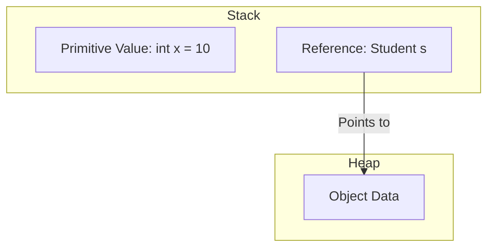

## Table of Contents

* [1. The Blueprint and the Building: Classes vs. Objects](#1-the-blueprint-and-the-building-classes-vs-objects)
* [2. Memory Management: Stack, Heap, & Garbage Collection](#2-memory-management-stack-heap--garbage-collection)
    * [2.1 Stack vs. Heap](#21-stack-vs-heap)
    * [2.2 Garbage Collection (GC)](#22-garbage-collection-gc)
    * [2.3 Chaos Path: The Null Pointer](#23-chaos-path-the-null-pointer)
* [3. Class Anatomy & Members](#3-class-anatomy--members)
    * [3.1 The Three Pillars of Class Members](#31-the-three-pillars-of-class-members)
    * [3.2 Modifiers: Controlling Access and Behavior](#32-modifiers-controlling-access-and-behavior)
    * [3.3 The `static` Keyword](#33-the-static-keyword)
    * [3.4 Chaos Path: Static vs. Instance](#34-chaos-path-static-vs-instance)
* [4. Abstraction: Interfaces vs. Abstract Classes](#4-abstraction-interfaces-vs-abstract-classes)
    * [4.1 Comparison](#41-comparison)
    * [4.2 Chaos Path: The "Can-Do" vs "Is-A" Confusion](#42-chaos-path-the-can-do-vs-is-a-confusion)

***

## 1. The Blueprint and the Building: Classes vs. Objects

The core of Java is the distinction between a template and an actual instance.

### 1.1 Conceptual Framework
To understand the difference, use the "Architectural Analogy":

| Concept | Analogy | Definition |
| :--- | :--- | :--- |
| **Class** | **Blueprints** | A template or "blueprint" that defines the properties (data) and behaviors (actions) that an entity will have. It occupies no memory for data until instantiated. |
| **Object** | **The House** | A concrete **instance** created from the class. It occupies space in memory and holds specific values for the properties defined by the class. |

**Vs: Class vs. Object**
A **Class** is a logical construct (a concept), while an **Object** is a physical construct (an entity in memory). You can have one `Car` class, but you can create thousands of unique `Car` objects (a red Toyota, a blue Ford, etc.).

[↑ Back to Table of Contents](#table-of-contents)
***

*Creating objects is only half the battle; we must understand the invisible memory management system that keeps the program running.*

## 2. Memory Management: Stack, Heap, & Garbage Collection

Java manages memory automatically, dividing it into two primary areas: the **Stack** and the **Heap**.

### 2.1 Stack vs. Heap

| Feature | **Stack Memory** | **Heap Memory** |
| :--- | :--- | :--- |
| **What is stored?** | Local variables and **references**  to objects. | The actual **objects** and instance variables. |
| **Lifecycle** | Short-lived. Cleared when a method finishes execution. | Long-lived. Lives as long as it is reachable, then eventually cleaned up. |
| **Management** | LIFO (Last-In-First-Out) structure; very fast. | Managed by the **Garbage Collector**. |
| **Error Type** | `StackOverflowError` (e.g., infinite recursion). | `OutOfMemoryError` (e.g., creating too many objects). |



### 2.2 Garbage Collection (GC)

**Garbage Collection** is the automated process of reclaiming heap memory by destroying objects that are no longer "reachable" by any live thread.

*   **Mechanism:** The JVM tracks references. If an object in the Heap can no longer be reached it is marked as "eligible for collection."
*   **Golden Rule:** You do not manually "delete" objects in Java. You simply stop using them (by setting their reference to `null` or letting a variable go out of scope), and the GC handles the rest.

### 2.3 Chaos Path: The Null Pointer

Because variables for objects are just "references" (addresses), they can sometimes point to **nothing**.

> [!WARNING]
> **The NullPointerException (NPE):** If a reference variable is set to `null`, it does not refer to an object. Attempting to call a method or access a field on a `null` reference will throw a `java.lang.NullPointerException` exception.

```java
Student s = null; 
System.out.println(s.name); // ❌ CRASH: NullPointerException
```

[↑ Back to Table of Contents](#table-of-contents)
***

*Now that we know where objects live, let's look inside a Class to see how they are structured and how we control access to their internals.*

## 3. Class Anatomy & Members

A **Class** is composed of several members that define its state and behavior.

### 3.1 The Three Pillars of Class Members

1.  **Fields (Attributes):** Variables that represent the state of the object (e.g., `String color;`).
2.  **Constructors:** Special members invoked when an object is instantiated (`new ClassName()`). They initialize the object's state.
3.  **Methods (Behaviors):** Functions defined within the class that describe what the object can *do* (e.g., `void drive()`).

**Implementation Example:**
```java
public class Car {
    // 1. Field
    String model;
    
    // 2. Constructor
    public Car(String modelName) {
        this.model = modelName;
    }
    
    // 3. Method
    public void drive() {
        System.out.println("The " + model + " is moving.");
    }
}

// Usage:
Car myCar = new Car("Toyota");
myCar.drive();
```

### 3.2 Modifiers: Controlling Access and Behavior

#### **1. Access Modifiers (Visibility)**
These define the "encapsulation" level—who can see your data.

| Modifier | Visibility Scope |
| :--- | :--- |
| **`public`** | Visible to **everyone** in the project. |
| **`protected`** | Visible to the **same package** and **subclasses**. |
| **`default`** | (No keyword) Visible only to the **same package**. |
| **`private`** | Visible **only within the same class**. |

#### **2. Non-Access Modifiers (Behavior)**
| Modifier | Effect |
| :--- | :--- |
| **`static`** | Belongs to the **Class itself**, not to individual objects. Shared by all instances. |
| **`final`** | **Constant.** A final variable cannot have its reference changed; a final method cannot be overridden. |
| **`abstract`** | Used for classes/methods that are **incomplete** and must be implemented by subclasses. |

### 3.3 The `static` Keyword

**`static`** members belong to the class rather than any specific object.

*   **Static Variable:** A single copy of the variable is shared across all instances (e.g., a `totalUsers` counter).
*   **Static Method:** Can be called without creating an object (e.g., `Math.sqrt()`). 

### 3.4 Chaos Path: Static vs. Instance

A common mistake is attempting to mix "Class-level" logic with "Object-level" data.

> [!IMPORTANT]
> **The Static Restriction:** A `static` method exists at the Class level. It **cannot** access non-static (instance) fields directly because the static method doesn't know *which* object's data to look at.

```java
public class Player {
    String name;       // Instance variable (unique to each player)
    static int count;  // Static variable (shared by all players)

    public static void printName() {
        // System.out.println(name); // ❌ Compile-time error: non-static variable 'name' cannot be referenced from a static context
        System.out.println("Printing player count: " + count); // ✅ This works!
    }
}
```

[↑ Back to Table of Contents](#table-of-contents)
***

*While classes provide the blueprint, we often need to define \"contracts\" for what a class must do without specifying how it does it.*

## 4. Abstraction: Interfaces vs. Abstract Classes

Abstraction allows us to hide complex implementation details and show only the necessary features of an object.

### 4.1 Comparison

| Feature | **Abstract Class** | **Interface** |
| :--- | :--- | :--- |
| **Purpose** | Defines a \"is-a\" relationship (identity). | Defines a \"can-do\" relationship (capability). |
| **Implementation** | Can have both implemented methods and abstract methods. | Can contain abstract methods as well as default, static, and private methods. |
| **Multiple Inheritance** | A class can extend only **one** abstract class. | A class can implement **multiple** interfaces. |
| **State** | Can have instance variables (fields). | only constants (`public static final`). |

### 4.2 Chaos Path: The "Can-Do" vs "Is-A" Confusion

The most frequent error in abstraction is choosing the wrong tool for the hierarchy.

*   **The Mistake:** Using an `Interface` to model an object's identity (e.g., `interface Dog`).
*   **The Consequence:** If you make `Dog` an interface, you cannot easily give it state (like `age` or `breed`) without making them `static constants`. 
*   **The Fix:** 
    *   Use an **Abstract Class** when you want to say: "This thing **is** a type of X" (e.g., `Dog extends Animal`).
    *   Use an **Interface** when you want to say: "This thing **can do** X" (e.g., `Dog implements Swimmable`).

[↑ Back to Table of Contents](#table-of-contents)
