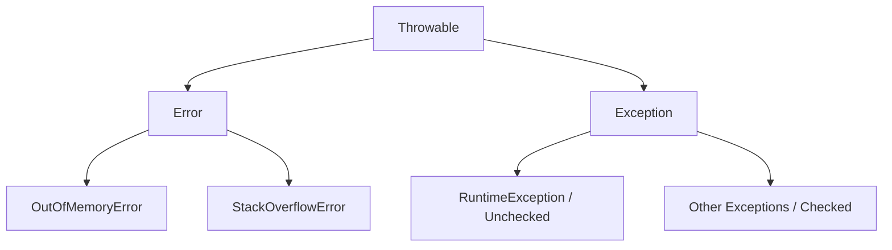

# Table of Contents

* [1. High-Level Overview](#1-high-level-overview)
* [2. Error Handling: The Fundamentals](#2-error-handling-the-fundamentals)
    * [2.1 Reading the Stack Trace](#21-reading-the-stack-trace)
    * [2.2 Exception vs. Error Hierarchy](#22-exception-vs-error-hierarchy)
    * [2.3 Checked vs. Unchecked Exceptions](#23-checked-vs-unchecked-exceptions)
* [3. Implementation: The Happy Path](#3-implementation-the-happy-path)
    * [3.1 The `try-catch-finally` Block](#31-the-try-catch-finally-block)
    * [3.2 The `throws` Keyword](#32-the-throws-keyword)
    * [3.3 Creating Custom Exceptions](#33-creating-custom-exceptions)
* [4. The Chaos Path: Common Pitfalls](#4-the-chaos-path-common-pitfalls)
    * [4.1 Exception Swallowing](#41-exception-swallowing)
    * [4.2 The `finally` Block Trap](#42-the-finally-block-trap)

***

## 1. High-Level Overview

In a perfect world, code executes linearly from start to finish. In reality, software operates in a volatile environment involving unpredictable user input, network instability, and hardware limitations. 

**Error Handling** is the discipline of anticipating these failures and providing a controlled way to recover or shut down gracefully. Instead of allowing a program to crash unceremoniously, we use the Java Exception mechanism to manage "exceptional" events, ensuring the system remains stable and provides meaningful feedback.

[↑ Back to Table of Contents](#table-of-contents)
***

## 2. Error Handling: The Fundamentals

*Before we can handle errors, we must learn how to read the "crime scene reports" left behind by the JVM.*

### 2.1 Reading the Stack Trace

When a program crashes, the JVM prints a **Stack Trace**. This is a snapshot of the method call stack at the moment the exception occurred.

**How to read it:**
1.  **The Top Line:** This is the most critical. It identifies the **Exception Type** (e.g., `NullPointerException`) and the **Error Message**.
2.  **The Trace (Top-to-Bottom):** Read the subsequent lines from **top to bottom**. The highest line in the trace is where the error actually occurred; as you move down, you are looking "backwards" through the chain of methods that called the failing line.

### 2.2 Exception vs. Error Hierarchy

Not all "problems" are created equal. Java distinguishes between recoverable application issues and fatal system failures.



| Category | Description | Recoverability | Examples |
| :--- | :--- | :--- | :--- |
| **Error** | Serious problems related to the **environment** or JVM. | **Not Recommended**. The program should usually terminate. | `OutOfMemoryError`, `StackOverflowError` |
| **Exception** | Problems caused by the **application logic** or external inputs. | **Recoverable**. Can be caught and handled. | `IOException`, `NullPointerException` |

### 2.3 Checked vs. Unchecked Exceptions

The distinction between these two determines how the Java compiler interacts with your code.

| Feature | **Checked Exception** | **Unchecked (Runtime) Exception** |
| :--- | :--- | :--- |
| **Definition** | Exceptions that the compiler **forces** you to handle. | Exceptions that are **not checked** by the compiler. Many indicate programming mistakes or improper usage of an API. |
| **Requirement** | You must use `try-catch` or declare `throws`. | You are not required to catch them (but should fix the logic). |
| **Example** | `IOException`, `SQLException` (External factors). | `NullPointerException`, `ArrayIndexOutOfBoundsException`. |

[↑ Back to Table of Contents](#table-of-contents)
***

## 3. Implementation: The Happy Path

*Now that we understand the hierarchy, let's look at the standard patterns for intercepting and managing these exceptions.*

### 3.1 The `try-catch-finally` Block (The Safety Net)

The `try-catch` block is used to intercept an exception so the program can continue running rather than crashing.

```java
try {
    int result = 10 / 0; // Potential ArithmeticException
} catch (ArithmeticException e) {
    // Handle the specific error
    System.out.println("Error: Cannot divide by zero!");
} finally {
    // This block executes whether or not an exception is thrown
    // Use this for cleanup (closing files, database connections, etc.)
    System.out.println("Cleanup: Closing resources...");
}
```

> [!NOTE]
> In modern Java, resource cleanup is often handled using try-with-resources, which automatically closes resources and is generally preferred over manual cleanup in finally blocks.

### 3.2 The `throws` Keyword (The Warning)

Sometimes, a method shouldn't handle its own error. Instead, it can "pass the buck" to the caller using the `throws` keyword.

> [!TIP]
> Using `throws` acts as a formal warning in your method signature, telling any developer using your method: *"Be careful, this method might fail in this specific way."*

```java
// This method warns that it might throw an IOException
public void readFile() throws IOException {
    // Logic that might fail due to missing files
}
```

### 3.3 Creating Custom Exceptions

When built-in exceptions are too generic to describe your business logic (e.g., `InsufficientFundsException`), you should create your own.

```java
public class InsufficientFundsException extends Exception {
    public InsufficientFundsException(String message) {
        super(message);
    }
}
```

[↑ Back to Table of Contents](#table-of-contents)
***

## 4. The Chaos Path: Common Pitfalls

*Handling exceptions is easy when everything goes right. The real test is when things go wrong in unexpected ways.*

### 4.1 Exception Swallowing

One of the most dangerous anti-patterns in Java is "swallowing" an exception. This happens when you catch an exception but do nothing with it.

```java
// ❌ DANGEROUS: The "Silent Killer"
try {
    performCriticalTask();
} catch (Exception e) {
    // Doing nothing here makes the error invisible!
    // The program continues in a broken state with no record of why.
}
```

> [!WARNING]
> **Never catch an exception and leave the block empty.** At the very least, log the error so there is a "paper trail" for debugging.

### 4.2 The `finally` Block Trap

A common misconception is that the `finally` block is a silver bullet for cleanup. However, if an exception is thrown *inside* the `finally` block itself, it can "mask" the original exception, making it nearly impossible to debug the initial failure.

```java
try {
    performTask(); // This throws an ArithmeticException
} catch (ArithmeticException e) {
    throw e; // Re-throwing the original error
} finally {
    // ❌ DANGER: If this throws a NullPointerException, 
    // the original ArithmeticException is LOST and replaced by this one.
    resource.close(); 
}
```

[↑ Back to Table of Contents](#table-of-contents)
