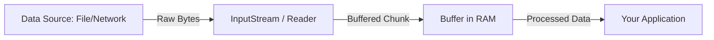

# Table of Contents

* [1. High-Level Overview: Volatility vs. Persistence](#1-high-level-overview-volatility-vs-persistence)
* [2. The I/O Architecture](#2-the-io-architecture)
    * [2.1 The Concept of Streams](#21-the-concept-of-streams)
    * [2.2 Byte Streams vs. Character Streams](#22-byte-streams-vs-character-streams)
* [3. The Implementation Toolkit](#3-the-implementation-toolkit)
    * [3.1 User Interaction: The `Scanner`](#31-user-interaction-the-scanner)
    * [3.2 File Operations: Reading and Writing](#32-file-operations-reading-and-writing)
    * [3.3 Object Persistence: Serialization](#33-object-persistence-serialization)
* [4. The Chaos Path: Common I/O Failures](#4-the-chaos-path-common-io-failures)
    * [4.1 Resource Leaks](#41-resource-leaks)
    * [4.2 Serialization Fragility](#42-serialization-fragility)
    * [4.3 The Encoding Nightmare](#43-the-encoding-nightmare)

***

## 1. High-Level Overview: Volatility vs. Persistence

In a running program, all data lives in **Volatile Memory (RAM)**. This memory is incredibly fast, but it has a fatal flaw: as soon as the program terminates or the power cuts out, every bit of data is lost.

**Input/Output (I/O)** is the mechanism we use to move data between the volatile world of the CPU/RAM and the **Persistent World** (Hard Drives, SSDs, Network Sockets). 

*   **Input:** Bringing data *into* the program (from a keyboard, a file, or a web request).
*   **Output:** Sending data *out* of the program (to a console, a file, or a database).

[↑ Back to Table of Contents](#table-of-contents)
***

## 2. The I/O Architecture

*To use I/O effectively, you must understand the "pipes" through which data flows.*

### 2.1 The Concept of Streams

In Java, I/O is modeled as a **Stream**—a continuous flow of data from a source to a destination. Imagine a water pipe: data enters one end and flows out the other. 

Because reading from a physical disk is thousands of times slower than reading from RAM, Java uses **Buffering**. Instead of reading one byte at a time (which is inefficient), a buffer reads a large "chunk" of data into memory at once, allowing the application to process it much faster.



### 2.2 Byte Streams vs. Character Streams

The most critical architectural decision in Java I/O is choosing the correct type of stream. Choosing the wrong one will result in corrupted data, especially when dealing with text.

| Feature | **Byte Streams** | **Character Streams** |
| :--- | :--- | :--- |
| **Data Unit** | 8-bit bytes | 16-bit Unicode characters |
| **Primary Use** | **Binary Data:** Images, audio, video, compiled `.class` files. | **Text Data:** `.txt`, `.csv`, `.json`, `.xml`. |
| **Logic** | Reads raw bits without interpretation. | Decodes and encodes character data using a character set (charset). |
| **Key Classes** | `FileInputStream`, `FileOutputStream` | `FileReader`, `FileWriter`, `BufferedReader` |

[↑ Back to Table of Contents](#table-of-contents)
***

## 3. The Implementation Toolkit

*Having understood the architecture, let's look at the specific tools used for common tasks.*

### 3.1 User Interaction: The `Scanner`

The `Scanner` class is the easiest way to capture input from the user via the console (`System.in`).

```java
import java.util.Scanner;

public class ConsoleInput {
    public static void main(String[] args) {
        // Use try-with-resources to ensure the scanner closes automatically
        try (Scanner scanner = new Scanner(System.in)) {
            System.out.print("Enter your name: ");
            String name = scanner.nextLine();

            System.out.print("Enter your age: ");
            int age = scanner.nextInt();

            System.out.println("Hello, " + name + "! Age: " + age);
        }
    }
}
```

> [!TIP]
> **The `nextLine()` Trap:** After calling `nextInt()` or `nextDouble()`, a "newline" character (`\n`) is left in the buffer. If you call `nextLine()` immediately after, it will read that empty newline instead of your actual input. Always call `scanner.nextLine()` once to consume the leftover newline before reading the next full line of text..

> [!WARNING]
> Once the `System.in` stream is closed it can not be opened again. As long as your application needs to accept user input you need to keep the stream open. The best option for this is to make a single Scanner object and reuse it as needed in your app

### 3.2 File Operations: Reading and Writing

For text files, we use `BufferedReader` and `BufferedWriter` for efficiency.

```java
import java.io.*;

public class FileHandler {
    public static void main(String[] args) {
        String fileName = "example.txt";

        // Writing Text
        try (BufferedWriter writer = new BufferedWriter(new FileWriter(fileName))) {
            writer.write("Learning Java I/O is powerful!");
        } catch (IOException e) {
            System.err.println("Write Error: " + e.getMessage());
        }

        // Reading Text
        try (BufferedReader reader = new BufferedReader(new FileReader(fileName))) {
            String line;
            while ((line = reader.readLine()) != null) {
                System.out.println("File Content: " + line);
            }
        } catch (IOException e) {
            System.err.println("Read Error: " + e.getMessage());
        }
    }
}
```

### 3.3 Object Persistence: Serialization

**Serialization** allows you to save the entire state of a Java object into a byte stream, which can be written to a file and reloaded later.

```java
import java.io.*;

class User implements Serializable {
    private static final long serialVersionUID = 1L; // Version control for the class
    String username;
    transient String password; // 'transient' means this field will NOT be saved

    public User(String username, String password) {
        this.username = username;
        this.password = password;
    }
}

public class SerializationDemo {
    public static void main(String[] args) throws Exception {
        User user = new User("admin", "super_secret_123");

        // 1. Save (Serialize)
        try (ObjectOutputStream out = new ObjectOutputStream(new FileOutputStream("user.ser"))) {
            out.writeObject(user);
        }

        // 2. Load (Deserialize)
        try (ObjectInputStream in = new ObjectInputStream(new FileInputStream("user.ser"))) {
            User loadedUser = (User) in.readObject();
            System.out.println("Username: " + loadedUser.username);
            System.out.println("Password: " + loadedUser.password); // Will be null
        }
    }
}
```

[↑ Back to Table of Contents](#table-of-contents)
***

## 4. The Chaos Path: Common I/O Failures

*In production, I/O is the most common source of crashes and resource exhaustion.*

### 4.1 Resource Leaks

Every time you open a file or a network socket, the Operating System allocates a "File Descriptor." These are limited resources. If you open files without closing them, your program will eventually crash with a `Too many open files` error.

> [!IMPORTANT]
> **Always use try-with-resources.** This ensures that every stream is automatically closed when the block ends, even if an exception is thrown. Never rely on manual `.close()` calls in a standard `try` block.

### 4.2 Serialization Fragility

If a serialized class changes in an incompatible way, or if the serialVersionUID no longer matches, deserialization may fail with an InvalidClassException.

*   **The Fix:** Defining serialVersionUID gives you explicit control over serialization version compatibility. Compatible changes (such as adding certain fields) can often be deserialized successfully, while incompatible structural changes may still cause problems.

### 4.3 The Encoding Nightmare

If you write a file using `UTF-8` but try to read it using `ISO-8859-1`, special characters (like `é`, `ñ`, or `©`) will turn into "garbage" characters (e.g., `é`).

*   **The Rule:** Explicitly specify a charset such as StandardCharsets.UTF_8 unless the file format requires a different encoding.

[↑ Back to Table of Contents](#table-of-contents)
