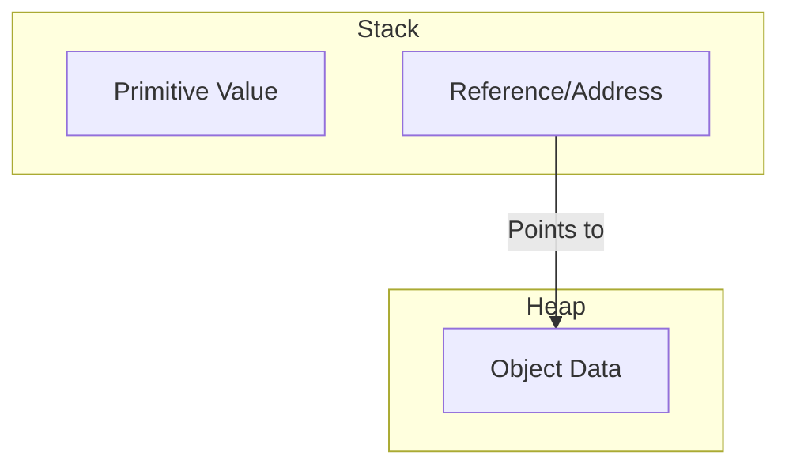

## Table of Contents

* [1. High-Level Overview](#1-high-level-overview)
* [2. Data Types & Memory Management](#2-data-types--memory-management)
    * [2.1 Primitive vs. Reference Types](#21-primitive-vs-reference-types)
    * [2.2 Primitive Data Types](#22-primitive-data-types)
    * [2.3 Wrapper Classes](#23-wrapper-classes)
* [3. Type Manipulation & Variables](#3-type-manipulation--variables)
    * [3.1 Casting (Type Conversion)](#31-casting-type-conversion)
    * [3.2 Variables and Memory: Value vs. Reference](#32-variables-and-memory-value-vs-reference)
* [4. String Handling & Text Manipulation](#4-string-handling--text-manipulation)
    * [4.1 String Basics](#41-string-basics)
    * [4.2 String Manipulation: StringBuilder vs. StringBuffer](#42-string-manipulation-stringbuilder-vs-stringbuffer)
* [5. Control Flow: Logic & Decision Making](#5-control-flow-logic--decision-making)
    * [5.1 Mathematical & Comparison Operators](#51-mathematical--comparison-operators)
    * [5.2 Logical Operators](#52-logical-operators)
    * [5.3 Conditional Statements](#53-conditional-statements)
* [6. Iteration & Data Grouping](#6-iteration--data-grouping)
    * [6.1 Control Flow Loops](#61-control-flow-loops)
    * [6.2 Arrays](#62-arrays)
* [7. Professional Development Workflow](#7-professional-development-workflow)
    * [7.1 Commenting](#71-commenting)
    * [7.2 Packages and Imports](#72-packages-and-imports)
    * [7.3 Debugging](#73-debugging)
* [8. Introduction to Algorithms & Data Structures](#8-introduction-to-algorithms--data-structures)
    * [8.1 What is an Algorithm?](#81-what-is-an-algorithm)
    * [8.2 Types of Algorithms](#82-types-of-algorithms)

***

*With the environment ready, we must now understand the fundamental building blocks of data: how Java stores and manipulates information.*

## 1. High-Level Overview

Java is a **Statically Typed** language, meaning every variable must have a declared type before it can be used. This allows the compiler to catch type-related errors before the program ever runs.

[↑ Back to Table of Contents](#table-of-contents)
***

## 2. Data Types & Memory Management

### 2.1 Primitive vs. Reference Types

Java categorizes data into two distinct groups based on how they are stored in memory.

| Feature | **Primitive Types** | **Reference Types** |
| :--- | :--- | :--- |
| **Definition** | Basic data types built into the language. | Objects created from classes. |
| **Storage** | Stored directly on the **Stack**. | The **Reference** is on the Stack; the **Object** is on the **Heap**. |
| **Nullability** | Cannot be `null`. | Can be `null`. |
| **Examples** | `int`, `double`, `boolean`, `char`. | `String`, `Arrays`, `Scanner`, custom Objects. |



### 2.2 Primitive Data Types

There are 8 primitive types in Java:

| Category | Type | Size | Description |
| :--- | :--- | :--- | :--- |
| **Integer** | `byte`, `short`, `int`, `long` | Varies | Whole numbers. |
| **Floating Point** | `float`, `double` | Varies | Numbers with fractional parts. |
| **Character** | `char` | 2 bytes | A single Unicode character. |
| **Logical** | `boolean` | JVM dependent | `true` or `false`. |

### 2.3 Wrapper Classes

Because primitives are not objects, Java provides **Wrapper Classes** to allow primitives to be used in contexts that require objects (like Collections/Generics).

*   **Mechanism:** **Autoboxing** is the automatic conversion the Java compiler makes between the primitive types and their corresponding object wrapper classes (e.g., `int` $\leftrightarrow$ `Integer`).

| Primitive | Wrapper Class |
| :--- | :--- |
| `int` | `Integer` |
| `double` | `Double` |
| `char` | `Character` |
| `boolean` | `Boolean` |

[↑ Back to Table of Contents](#table-of-contents)
***

*Managing these types requires understanding how they move between different formats and how they interact with variables.*

## 3. Type Manipulation & Variables

### 3.1 Casting (Type Conversion)

Casting is the process of converting a value from one data type to another.

**1. Widening Casting (Implicit/Automatic)**
Converting a smaller type to a larger type size. No data loss occurs.
`byte` → `short` → `int` → `long` → `float` → `double`
```java
int myInt = 9;
double myDouble = myInt; // Automatic casting: 9.0
```

**2. Narrowing Casting (Explicit/Manual)**
Converting a larger type to a smaller size. Potential data loss occurs.
```java
double myDouble = 9.78d;
int myInt = (int) myDouble; // Manual casting: 9 (decimal lost)
```

### 3.2 Variables and Memory: Value vs. Reference

Understanding how variables hold data is critical for avoiding logic errors.

*   **Value Types (Primitives):** The variable holds the **actual value**. When you assign `a = b`, a copy of the value is made. Changing `a` does not affect `b`.
*   **Reference Types (Objects):** The variable holds the **memory address** (the reference) of the object. When you assign `objA = objB`, both variables now point to the *same object* in memory.

```java
// --- Value Type (Primitive) ---
int a = 10;
int b = a; // b gets a copy of the value 10
b = 20;    // changing b does NOT change a
System.out.println(a); // Output: 10

// --- Reference Type (Object) ---
int[] arr1 = {1, 2, 3};
int[] arr2 = arr1; // arr2 points to the SAME memory address as arr1
arr2[0] = 99;      // modifying arr2 ALSO modifies arr1
System.out.println(arr1[0]); // Output: 99
```

> [!IMPORTANT]
> **The Reference Trap:** If you have two reference variables pointing to the same object, modifying the object through one variable will be visible when accessing it through the other.

[↑ Back to Table of Contents](#table-of-contents)
***

*While primitives and general objects handle most data, text manipulation requires specialized tools to ensure performance and efficiency.*

## 4. String Handling & Text Manipulation

In Java, strings are objects, but they behave uniquely due to their importance.

### 4.1 String Basics

The `String` class represents a sequence of characters.

> [!WARNING]
> **Immutability:** `String` objects are **immutable**. Once a `String` object is created, its content cannot be changed. Any \"modification\" (like `.toUpperCase()`) actually creates a brand new `String` object in memory.

### 4.2 String Manipulation: StringBuilder vs. StringBuffer

Because `String` is immutable, performing many concatenations in a loop is highly inefficient. To solve this, Java provides mutable alternatives.

| Feature | **String** | **StringBuilder** | **StringBuffer** |
| :--- | :--- | :--- | :--- |
| **Mutability** | **Immutable** (cannot change) | **Mutable** (can change) | **Mutable** (can change) |
| **Thread Safety** | Yes (by virtue of immutability) | **No** (Not thread-safe) | **Yes** (Thread-safe) |
| **Performance** | Slow for frequent changes | **Fastest** | Slower than StringBuilder |
| **Use Case** | Constant text/small changes | Single-threaded logic/Loops | Multi-threaded environments |

**Implementation Example:**
```java
// Using StringBuilder for efficient concatenation
StringBuilder sb = new StringBuilder("Hello");
sb.append(" World"); 
sb.append("!");
String result = sb.toString(); // "Hello World!"
```

[↑ Back to Table of Contents](#table-of-contents)
***

*Decisions allow us to branch, but loops allow us to traverse data and repetition.*

## 5. Control Flow: Logic & Decision Making

**Control Flow** refers to the order in which individual statements, instructions, or function calls are executed.

### 5.1 Mathematical & Comparison Operators

**1. Mathematical (Arithmetic) Operators**
| Operator | Name | Example (`int a=10, b=3`) | Result |
| :--- | :--- | :--- | :--- |
| `+` | Addition | `a + b` | `13` |
| `-` | Subtraction | `a - b` | `7` |
| `*` | Multiplication | `a * b` | `30` |
| `/` | Division | `a / b` | `3` (Integer division) |
| `%` | Modulo | `a % b` | `1` (Remainder) |

**2. Comparison (Relational) Operators**
| Operator | Name | Example |
| :--- | :--- | :--- |
| `==` | Equal to | `5 == 5` → `true` |
| `!=` | Not equal to | `5 != 3` → `true` |
| `>` | Greater than | `5 > 10` → `false` |
| `<` | Less than | `5 < 10` → `true` |

### 5.2 Logical Operators

| Operator | Name | Description | Example |
| :--- | :--- | :--- | :--- |
| `&&` | **Logical AND** | Returns `true` only if **both** sides are true. | `(5 > 3 && 2 < 4)` → `true` |
| `\|\|` | **Logical OR** | Returns `true` if **at least one** side is true. | `(5 > 3 \|\| 2 > 4)` → `true` |
| `!` | **Logical NOT** | Reverses the boolean value. | `!(5 > 3)` → `false` |

### 5.3 Conditional Statements

**1. If-Else Structure**
```java
int age = 18;
if (age >= 18) {
    System.out.println(\"Adult\");
} else if (age > 12) {
    System.out.println(\"Teenager\");
} else {
    System.out.println(\"Child\");
}
```

**2. Switch Statement**
```java
int day = 2;
switch (day) {
    case 1: System.out.println(\"Monday\"); break;
    case 2: System.out.println(\"Tuesday\"); break;
    default: System.out.println(\"Invalid day\");
}
```

[↑ Back to Table of Contents](#table-of-contents)
***

*Decisions allow us to branch, but loops allow us to traverse data and repetition.*

## 6. Iteration & Data Grouping

### 6.1 Control Flow Loops

| Loop Type | Mechanism | Best Use Case |
| :--- | :--- | :--- |
| **`for` loop** | Pre-determines the number of iterations. | When you know exactly **how many times** to loop. |
| **`while` loop** | Checks condition **before** executing the block. | When you loop until a condition changes (unknown count). |
| **`do-while`** | Checks condition **after** executing the block. | When the code **must run at least once**. |
| **Enhanced `for`** | Iterates through every element in a collection. | When you want to visit **every item** in an Array or List. |

### 6.2 Arrays

An **Array** is a container object that holds a fixed number of values of a single type.

*   **Fixed Size:** Once created, an array's length cannot be changed.
*   **Indexing:** Arrays are **zero-indexed**. The first element is at index `0`.

```java
// Declaration and Initialization
int[] numbers = {10, 20, 30, 40, 50};

// Accessing elements
System.out.println(numbers[0]); // Output: 10

// Modifying elements
numbers[1] = 25; 

// Iterating through an array (Enhanced for-loop)
for (int num : numbers) {
    System.out.print(num + \" \"); // Output: 10 25 30 40 50 
}
```

> [!WARNING]
> **The Index Out of Bounds Chaos:** If you attempt to access `numbers[5]` in an array of size 5, Java will throw an `ArrayIndexOutOfBoundsException`. Because arrays are fixed-size, there is no "automatic growth."

[↑ Back to Table of Contents](#table-of-contents)
***

*As programs grow in complexity, we must move from writing \"scripts\" to organizing professional software through modules and debugging tools.*

## 7. Professional Development Workflow

### 7.1 Commenting

| Style | Syntax | Use Case |
| :--- | :--- | :--- |
| **Single-line** | `// comment` | Brief notes on a specific line. |
| **Multi-line** | `/* comment */` | Longer descriptions or \"commenting out\" code blocks. |
| **Documentation** | `/** comment */` | **Javadoc** comments; used to generate professional API documentation. |

### 7.2 Packages and Imports

*   **Packages:** A grouping of related classes (e.g., `package com.myapp.utils;`). It acts like a folder on your computer.
*   **Imports:** A way to tell the compiler that you want to use a class located in a different package (e.g., `import java.util.Scanner;`).

> [!TIP]
> **The `java.lang` Exception:** The `java.lang` package (which contains fundamental classes like `String` and `System`) is available **automatically**. You never need to write `import java.lang.*;`.

### 7.3 Debugging

**Debugging** is the process of finding and resolving defects (bugs) in your code.

*   **Print Debugging:** Using `System.out.println()` to track variable values (quick but messy).
*   **IDE Debuggers (Professional):** Using tools in IntelliJ or Eclipse to set **Breakpoints**. A breakpoint pauses the program at a specific line, allowing you to inspect the entire \"state\" of the application (variables, call stack, memory) in real-time.

[↑ Back to Table of Contents](#table-of-contents)
***

*With the tools to build and debug software in place, we enter the realm of Computer Science: how to solve problems efficiently using Algorithms and Data Structures.*

## 8. Introduction to Algorithms & Data Structures

### 8.1 What is an Algorithm?

An **Algorithm** is a finite, step-by-step procedure or a set of rules to be followed in calculations or other problem-solving operations. In simpler terms: **Input → Algorithm → Output**.

**Characteristics of a good algorithm:**
1.  **Finiteness:** It must eventually stop.
2.  **Definiteness:** Each step must be precisely defined.
3.  **Efficiency:** It should solve the problem using minimal time and memory.

### 8.2 Types of Algorithms

| Type | Description | Example |
| :--- | :--- | :--- |
| **Sorting Algorithms** | Arranging data in a specific order (numerical or alphabetical). | Bubble Sort, Quick Sort, Merge Sort. |
| **Searching Algorithms** | Finding a specific target within a collection of data. | Linear Search, Binary Search. |
| **Divide & Conquer** | Breaking a complex problem into smaller, manageable sub-problems. | Merge Sort. |
| **Greedy Algorithms** | Making the locally optimal choice at each step to find a global optimum. | Dijkstra's Shortest Path. |
| **Dynamic Programming**| Solving complex problems by breaking them into overlapping sub-problems and storing results. | Fibonacci Sequence calculation. |

> [!NOTE]
> **The Relationship:** **Data Structures** (how you organize data, like Arrays or Lists) and **Algorithms** (how you process that data) work together. An efficient algorithm often requires a specific data structure to perform at its best.

[↑ Back to Table of Contents](#table-of-contents)
