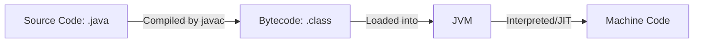

## Table of Contents

* [1. High-Level Overview](#1-high-level-overview)
* [2. The Java Ecosystem (JVM, JRE, JDK)](#2-the-java-ecosystem-jvm-jre-jdk)
    * [2.1 Structural Framework](#21-structural-framework)
    * [2.2 JRE vs. JDK](#22-jre-vs-jdk)
* [3. Getting Started: Setup & Hello World](#3-getting-started-setup--hello-world)
    * [3.1 Environment Setup](#31-environment-setup)
    * [3.2 The "Hello World" Implementation](#32-the-hello-world-implementation)
    * [3.3 Anatomy of the `main` Method](#33-anatomy-of-the-main-method)
    * [3.4 Execution Workflow](#34-execution-workflow)
* [4. Nuance & Common Pitfalls](#4-nuance--common-pitfalls)
    * [4.1 The Lifecycle of a Java Program](#41-the-lifecycle-of-a-java-program)
    * [4.2 Portability "Chaos" Scenarios](#42-portability-chaos-scenarios)
    * [4.3 Common Errors](#43-common-errors)

***

## 1. High-Level Overview

**Java** is a high-level, class-based, object-oriented programming language designed to have as few implementation dependencies as possible. Its guiding principle is **"Write Once, Run Anywhere" (WORA)**, meaning compiled Java code can run on all platforms that support Java without the need for recompilation. This is achieved through the abstraction provided by the **Java Virtual Machine (JVM)**.

[↑ Back to Table of Contents](#table-of-contents)
***

## 2. The Java Ecosystem (JVM, JRE, JDK)

To understand how Java works, one must distinguish between the three core components that allow code to be developed, compiled, and executed.

### 2.1 Structural Framework

The relationship between these three components is hierarchical: the **JDK** contains the **JRE**, which in turn contains the **JVM**.

| Component | Full Name | Purpose | Contents |
| :--- | :--- | :--- | :--- |
| **JVM** | Java Virtual Machine | The **execution engine** that runs the bytecode. | Just-In-Time (JIT) compiler, Interpreter, Garbage Collector. |
| **JRE** | Java Runtime Environment | The **environment** required to *run* Java applications. | JVM + Core Class Libraries (e.g., `java.lang`, `java.util`). |
| **JDK** | Java Development Kit | The **toolkit** required to *develop* and *run* Java applications. | JRE + Development Tools (e.g., `javac` compiler, `jdb` debugger). |

### 2.2 JRE vs. JDK

The fundamental difference is **intent**. 

* **Use the JRE** if you only want to play a Java-based game or run an existing Java application.
* **Use the JDK** if you intend to write code, compile it into bytecode, and develop new software.

[↑ Back to Table of Contents](#table-of-contents)
***

*Now that we understand the environment required to run Java, let's walk through the initial setup and our first execution.*

## 3. Getting Started: Setup & Hello World

### 3.1 Environment Setup

To begin development, you must install the **JDK**. 

1. **Download:** Obtain a **JDK** distribution (e.g., Oracle JDK or OpenJDK).
2. **Installation:** Follow the installer prompts for your OS.
3. **Environment Variables:** Ensure your `JAVA_HOME` is set and the `bin` directory is added to your system `PATH` so you can run `java` and `javac` from any terminal.

> [!IMPORTANT]
> If `javac` is not recognized in your terminal after installation, your `PATH` variable is likely not configured correctly to point to the JDK `bin` folder.

### 3.2 The "Hello World" Implementation

The following code demonstrates the minimal structure required for a Java program.

```java
// File name must match the class name: HelloWorld.java
public class HelloWorld {
    public static void main(String[] args) {
        System.out.println("Hello, World!");
    }
}
```

> [!TIP]
> In Java, the **public class** name must exactly match the filename. If your class is `HelloWorld`, your file **must** be named `HelloWorld.java`.

### 3.3 Anatomy of the `main` Method

To a beginner, `public static void main(String[] args)` looks like magic. However, every keyword serves a specific purpose for the **JVM**:

| Keyword | Role | Why it's required |
| :--- | :--- | :--- |
| **`public`** | Access Modifier | Allows the **JVM** (which lives outside your program) to access and run the method. |
| **`static`** | Scope Modifier | Allows the method to be called without first creating an "instance" (object) of the class. |
| **`void`** | Return Type | Tells the JVM that this method performs an action but does not return any data back to the caller. |
| **`main`** | Method Name | The standard entry point name that the JVM searches for to start execution. |
| **`String[] args`** | Parameter | A way to pass command-line arguments into the program as an array of Strings. |

### 3.4 Execution Workflow

The transformation from source code to a running program involves two distinct steps: **Compilation** and **Execution**.

1. **Compile:** `javac HelloWorld.java` $\rightarrow$ Produces `HelloWorld.class` (**Bytecode**).
2. **Run:** `java HelloWorld` $\rightarrow$ The **JVM** executes the bytecode.

[↑ Back to Table of Contents](#table-of-contents)
***

*While the "Happy Path" is straightforward, understanding the nuances of the underlying technology is key to professional development.*

## 4. Nuance & Common Pitfalls

### 4.1 The Lifecycle of a Java Program

The magic of **WORA** happens through a specific sequence of transformations. Understanding this sequence is vital for debugging.



1. **Source Code:** The human-readable text you write.
2. **Compilation:** The `javac` tool translates source code into **Bytecode**.
3. **Loading:** The **JVM** loads the bytecode into memory.
4. **Execution:** The **JVM** translates the bytecode into specific **Machine Code** for the current hardware (Windows, Linux, etc.).

### 4.2 Portability "Chaos" Scenarios

Since Java relies on the **JVM** to bridge the gap between code and hardware, "Chaos" usually arises when the bridge is broken.

**Scenario: The Version Mismatch**
* **The Setup:** You compile your code using **JDK 21** on your laptop. You then send the `.class` file to a server that only has **JRE 8** installed.
* **The Result:** The program will crash with a `java.lang.UnsupportedClassVersionError`. 
* **The Lesson:** While the *language* is portable, the **Bytecode** version must be compatible with the version of the **JVM** running it.

### 4.3 Common Errors

| Symptom | Diagnosis | Rescue |
| :--- | :--- | :--- |
| `error: class HelloWorld is public, should be declared in a file named HelloWorld.java` | Filename mismatch. | Rename the file to match the `public class` name exactly (including capitalization). |
| `'javac' is not recognized as an internal or external command` | `PATH` not configured. | Add the JDK `bin` directory to your system's `PATH` environment variable. |
| `java.lang.NoSuchMethodError: main` | Missing `main` method. | Ensure your class contains `public static void main(String[] args)`. |

[↑ Back to Table of Contents](#table-of-contents)
