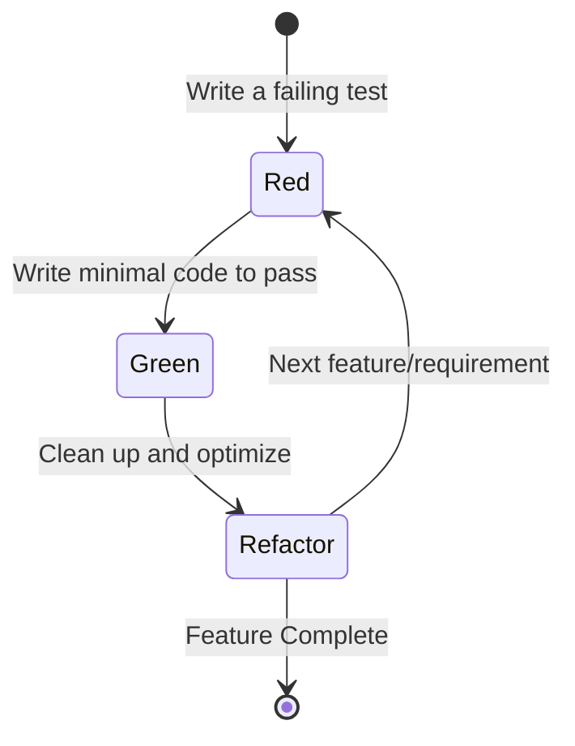

# Unit Testing & TDD Mastery

## Table of Contents

* [1. Test-Driven Development (TDD)](#1-test-driven-development-tdd)
* [2. Testing Scope: Unit vs. Integration](#2-testing-scope-unit-vs-integration)
* [3. JUnit Fundamentals](#3-junit-fundamentals)
* [4. Measuring Test Quality: Line vs. Branch Coverage](#4-measuring-test-quality-line-vs-branch-coverage)
* [5. The AAA Pattern: Arrange, Act, Assert](#5-the-aaa-pattern-arrange-act-assert)
* [6. Assertion Mastery](#6-assertion-mastery)
* [7. Mocking & Isolation: Introduction to Mockito](#7-mocking--isolation-introduction-to-mockito)
    * [7.1 Mocking vs. Stubbing](#71-mocking-vs-stubbing)
* [8. The Chaos Path: Test Fragility & Flakiness](#8-the-chaos-path-test-fragility--flakiness)
    * [8.1 Flaky Tests (Non-Determinism)](#81-flaky-tests-non-determinism)
    * [8.2 Test Pollution](#82-test-pollution)
    * [8.3 The Brittle Test (Over-Mocking)](#83-the-brittle-test-over-mocking)

***

## 1. Test-Driven Development (TDD)

**Test-Driven Development (TDD)** is a software development process where you write tests *before* you write the actual functional code. It flips the traditional "code then test" model on its head to ensure that code is designed for testability and correctness from the very first line.

### The TDD Cycle: Red-Green-Refactor

The core of TDD is a repetitive, short cycle often referred to as the **Red-Green-Refactor** loop:



1.  **🔴 RED:** Write a small, failing test for a specific piece of functionality. The test must fail (ideally because the code doesn't even exist yet).
2.  **🟢 GREEN:** Write the *minimum* amount of code necessary to make that test pass. Don't worry about elegance here; focus on correctness.
3.  **🔵 REFACTOR:** Clean up the code you just wrote. Improve its structure, remove duplication, and ensure it follows best practices, while ensuring the test *stays* green.

> [!IMPORTANT]
> TDD is not just about finding bugs; it is a **design tool**. By writing tests first, you are forced to think about how your code will be *used* (the interface) before you worry about how it will be *implemented*.

[↑ Back to Table of Contents](#table-of-contents)
***

*While TDD provides the methodology for development, we must define the scale at which these tests operate.*

## 2. Testing Scope: Unit vs. Integration

In the "Testing Pyramid," we distinguish between different levels of testing based on their scope and complexity. Understanding the boundary between **Unit Testing** and **Integration Testing** is critical for building a stable test suite.

- **TODO: add testing pyramid image**

| Feature | **Unit Testing** | **Integration Testing** |
| :--- | :--- | :--- |
| **Scope** | Tests a small unit of behavior in isolation from external dependencies. | Interaction between multiple components/modules. |
| **Isolation** | Highly isolated; uses mocks/stubs for dependencies. | Tests real connections (DB, File System, APIs). |
| **Speed** | Extremely fast. | Quick, typically not Unit Testing fast. |
| **Complexity** | Low unless mocking/stubbing. | Medium due to environmental setup. |
| **Failure Cause** | Logic error within the specific unit. | Interface mismatch, config error, or network issue. |

**Unit Testing vs. Integration Testing**
The fundamental difference is **dependency management**. A Unit Test treats a database or a web service as a "black box" and replaces it with a controlled substitute. An Integration Test verifies that the "glue" between your code and the database actually works.

[↑ Back to Table of Contents](#table-of-contents)
***

*To implement these tests in the Java ecosystem, we rely on the industry standard: JUnit.*

## 3. JUnit Fundamentals

**JUnit** is the most widely used testing framework for Java. It provides the annotations and assertion libraries needed to define, run, and organize tests efficiently.

### Dependency Management (Maven)
To use JUnit 5 in your project, add the following dependency to your `pom.xml`:

```xml
<dependencies>
    <dependency>
        <groupId>org.junit.jupiter</groupId>
        <artifactId>junit-jupiter-api</artifactId>
        <version>5.10.0</version>
        <scope>test</scope>
    </dependency>
    <dependency>
        <groupId>org.junit.jupiter</groupId>
        <artifactId>junit-jupiter-engine</artifactId>
        <version>5.10.0</version>
        <scope>test</scope>
    </dependency>
</dependencies>
```

### Core JUnit Annotations

| Annotation | Purpose |
| :--- | :--- |
| `@Test` | Marks a method as a test case. |
| `@BeforeEach` | Runs before **each** individual test method (setup). |
| `@AfterEach` | Runs after **each** individual test method (teardown). |
| `@BeforeAll` | Runs **once** before all tests in the class (static). |
| `@AfterAll` | Runs **once** after all tests in the class (static). |
| `@Disabled` | Skips a test method (useful for known issues). |

**Example JUnit Test Structure:**
```java
import org.junit.jupiter.api.*;
import static org.junit.jupiter.api.Assertions.*;

class CalculatorTest {

    Calculator calc;

    @BeforeEach
    void setUp() {
        calc = new Calculator();
    }

    @Test
    @DisplayName("Addition should return correct sum")
    void testAddition() {
        assertEquals(5, calc.add(2, 3), "2 + 3 should be 5");
    }
}
```

[↑ Back to Table of Contents](#table-of-contents)
***

*Simply having tests isn't enough; we need to know how thoroughly those tests are actually exercising our code.*

## 4. Measuring Test Quality: Line vs. Branch Coverage

**Code Coverage** is a metric used to quantify how much of your source code is executed during testing. However, not all coverage is created equal.

### Line Coverage vs. Branch Coverage

| Metric | Definition | Strength | Weakness |
| :--- | :--- | :--- | :--- |
| **Line Coverage** | Percentage of executable lines of code that were hit by tests. | Easy to understand and calculate. | Can be deceptive. You can hit a line without testing all logic paths. |
| **Branch Coverage** | Percentage of decision points (if/else, switch) where every possible path was taken. | Much more rigorous; ensures logic is fully explored. | Harder to achieve 100%; requires more complex test cases. |

**The Danger of Line Coverage**
Consider this code:
```java
if (user.isActive() && user.hasPermission()) {
    doSomething();
}
```
If your test only checks a case where both conditions are `true`, you have **100% Line Coverage** for that block, but you have **not** tested the scenarios where the user is inactive or lacks permission. **Branch Coverage** would force you to write tests for those specific decision outcomes.

[↑ Back to Table of Contents](#table-of-contents)
***

*Now that we understand the scope and coverage, let's look at the standardized pattern for writing an individual test case.*

## 5. The AAA Pattern: Arrange, Act, Assert

To make tests readable and maintainable, professional developers follow the **AAA Pattern**. This pattern creates a clear logical separation between the setup, the execution, and the verification.

### The Three Pillars of AAA

1.  **Arrange:** Set up the environment. Initialize objects, create mocks, and prepare the input data.
2.  **Act:** Execute the specific method or behavior you are testing. This should ideally be a single line of code.
3.  **Assert:** Verify that the outcome matches your expectations.

**AAA in Practice:**
```java
@Test
void testWithdrawMoney() {
    // 1. ARRANGE
    Account account = new Account(100.0); // Start with $100
    double amountToWithdraw = 40.0;

    // 2. ACT
    account.withdraw(amountToWithdraw);

    // 3. ASSERT
    assertEquals(60.0, account.getBalance(), "Balance should be $60 after withdrawal");
}
```

> [!TIP]
> If your "Act" section contains multiple method calls, your test might be doing too much. Try to keep the "Act" phase focused on a single behavior to prevent "God Tests."

[↑ Back to Table of Contents](#table-of-contents)
***

*The "Assert" phase is where the magic happens. To do this effectively, you must master the different types of assertions available.*

## 6. Assertion Mastery

An **Assertion** is an expression that compares the *actual* result of your code against the *expected* result. If the assertion fails, the test fails.

### Common Assertion Types (JUnit 5)

| Type | Method | Description |
| :--- | :--- | :--- |
| **Equality** | `assertEquals(expected, actual)` | Checks if two values are equal. |
| **Identity** | `assertSame(expected, actual)` | Checks if two references point to the exact same object. |
| **Nullity** | `assertNull(actual)` / `assertNotNull(actual)` | Checks if an object is null or not. |
| **Truthiness** | `assertTrue(condition)` / `assertFalse(condition)` | Checks if a boolean expression is true or false. |
| **Exceptions** | `assertThrows(Exception.class, executable)` | Verifies that a specific block of code throws a specific exception. |

**Example: Testing an Exception**
```java
@Test
void testNegativeWithdrawalThrowsException() {
    Account account = new Account(100.0);
    
    assertThrows(IllegalArgumentException.class, () -> {
        account.withdraw(-50.0);
    }, "Withdrawing negative amount should throw exception");
}
```

[↑ Back to Table of Contents](#table-of-contents)
***

*Real-world classes often have complex dependencies like Databases or APIs. To test them in isolation, we must move beyond real objects and use Mocking.*

## 7. Mocking & Isolation: Introduction to Mockito

In Unit Testing, we want to test a class in **isolation**. If `Class A` depends on `Class B`, we don't want a failure in `Class B` to cause our test for `Class A` to fail. To solve this, we use **Mocking**.

**Mockito** is the premier library for creating "double" objects that simulate the behavior of real dependencies.

### Dependency Management (Maven)
To use Mockito in your project, add the following dependency to your `pom.xml`:

```xml
<dependencies>
    <dependency>
        <groupId>org.mockito</groupId>
        <artifactId>mockito-core</artifactId>
        <version>5.5.0</version>
        <scope>test</scope>
    </dependency>
    <dependency>
        <groupId>org.mockito</groupId>
        <artifactId>mockito-junit-jupiter</artifactId>
        <version>5.5.0</version>
        <scope>test</scope>
    </dependency>
</dependencies>
```

### 7.1 Mocking vs. Stubbing

While often used interchangeably, there is a subtle technical distinction between a **Mock** and a **Stub**.

| Concept | Definition | Purpose |
| :--- | :--- | :--- |
| **Stub** | A "dumb" object that provides canned, hardcoded answers to calls. | Providing necessary input data to the system under test. |
| **Mock** | A more sophisticated object that records *how* it was called (how many times, with what arguments). | Verifying the *interactions* and behavior of the system under test. |

**Example: Using Mockito to Stub and Mock**

```java
import static org.mockito.Mockito.*;
import org.junit.jupiter.api.Test;

class UserServiceTest {

    @Test
    void testGetUserEmail() {
        // 1. ARRANGE
        // Create a Mock (and a Stub) of the UserRepository
        UserRepository mockRepo = mock(UserRepository.class);
        
        User fakeUser = new User("test@example.com");
        
        // STUBBING: Telling the mock to return our fakeUser when findById is called
        when(mockRepo.findById(1L)).thenReturn(fakeUser);
        
        UserService userService = new UserService(mockRepo);

        // 2. ACT
        String email = userService.getUserEmail(1L);

        // 3. ASSERT
        // Verify the outcome (Assertion)
        assertEquals("test@example.com", email);
        
        // Verify the interaction (Mocking/Verification)
        // This ensures the service actually called the repository as expected
        verify(mockRepo, times(1)).findById(1L);
    }
}
```

> [!WARNING]
> **The Over-Mocking Trap**
> 
> Avoid mocking everything. If you mock every single object, you aren't testing your application's logic—you are merely testing that your mocks work.
>
> **Best Practices:**
> * **Mock Out-of-Process Dependencies:** Focus on databases, network calls, or file systems.
> * **Keep Logic Real:** Use real implementations for internal utility classes or simple data objects.
> * **Balance is Key:** Aim for a test suite that verifies actual behavior, not just internal method calls.

[↑ Back to Table of Contents](#table-of-contents)

## 8. The Chaos Path: Test Fragility & Flakiness

*In production-grade pipelines, tests often fail not because of bugs, but because of environment instability or poor isolation.*

### 8.1 Flaky Tests (Non-Determinism)

A **Flaky Test** is a test that provides inconsistent results—sometimes passing, sometimes failing—without any changes to the code. These are the "silent killers" of CI/CD pipelines because they destroy trust in the automation.

**Common Culprits:**
* **Race Conditions:** Tests that rely on specific thread execution orders or timing.
* **Shared State:** Tests that modify a static field or a singleton that isn't reset between runs.
* **External Dependencies:** Tests that hit a real network or a shared database that might be slow or unavailable.

> [!TIP]
> **The Fix: Aim for Hermetic Tests.** A hermetic test is entirely self-contained. It creates its own data, uses its own isolated environment, and cleans up after itself. If a test can run on a laptop with no Wi-Fi, it is a high-quality test.

### 8.2 Test Pollution

**Test Pollution** occurs when the side effects of one test leak into another. This violates the fundamental principle of **Isolation** and makes debugging nearly impossible.

**The Scenario:**
1. **Test A** creates a user in a shared in-memory database.
2. **Test B** expects the database to be empty but finds the user from Test A.
3. **Result:** Test B fails, even though the code for Test B is perfectly correct.

**The Defense:**
* **Strict Setup/Teardown:** Always use `@BeforeEach` or `@AfterEach` to reset every piece of state.
* **Unique Identity:** Use UUIDs or unique prefixes for all data created during a test to prevent collisions.

### 8.3 The Brittle Test (Over-Mocking)

A **Brittle Test** is a test that is too tightly coupled to the internal implementation of the code. It passes today, but breaks tomorrow even if the actual functionality remains unchanged.

**The Symptom:** You refactor a private method to be more efficient, and suddenly 50 tests fail, even though the public API output is identical.

**The Cure: Behavioral vs. Implementation Testing**
* **Don't test the "How":** Avoid verifying the exact sequence of internal method calls.
* **Test the "What":** Focus on the observable behavior—the return value, the state change, or the side effect.

[↑ Back to Table of Contents](#table-of-contents)