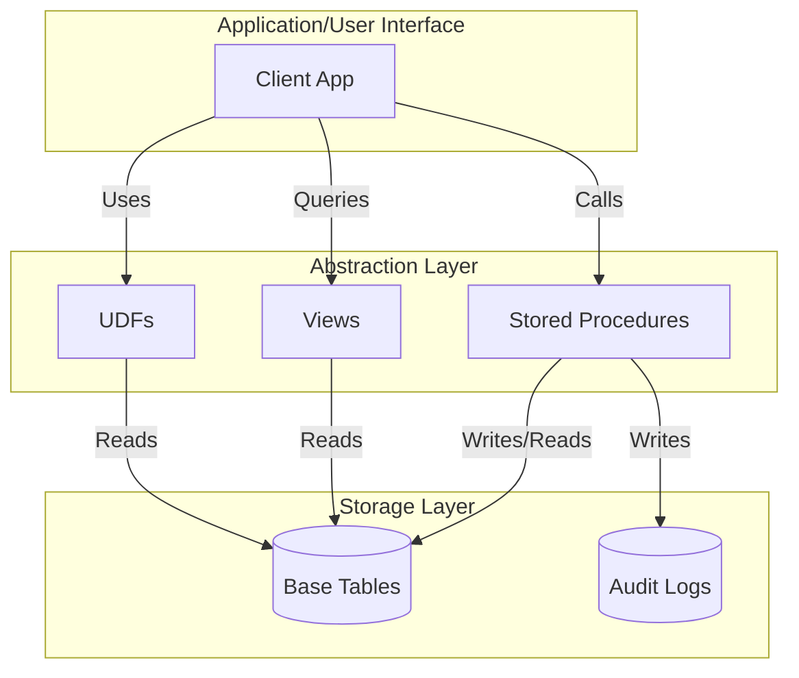

# Advanced SQL

## Table of Contents

* [1. High-Level Overview: Beyond Basic Queries](#1-high-level-overview-beyond-basic-queries)
* [2. Performance Optimization: Indexes](#2-performance-optimization-indexes)
* [3. Data Transformation: Scalar Functions](#3-data-transformation-scalar-functions)
* [4. Automated Logic: Sequence & Triggers](#4-automated-logic-sequence--triggers)
* [5. Abstraction & Encapsulation](#5-abstraction--encapsulation)
    * [5.1 The Abstraction Layer (Visualized)](#51-the-abstraction-layer-visualized)
    * [5.2 Views](#52-views)
    * [5.3 Stored Procedures](#53-stored-procedures)
    * [5.4 User-Defined Functions (UDF)](#54-user-defined-functions-udf)
* [6. Chaos Path: When Advanced SQL Fails](#6-chaos-path-when-advanced-sql-fails)

***

## 1. High-Level Overview: Beyond Basic Queries

Standard SQL (`SELECT`, `INSERT`, `UPDATE`, `DELETE`) allows you to interact with data. However, in enterprise-grade environments, simply "interacting" with data isn't enough. You need to make it **fast**, **consistent**, **automated**, and **reusable**.

**Advanced SQL** encompasses the tools and techniques used to optimize performance, automate complex business logic, and create layers of **abstraction** that protect the underlying complexity of the database.

[↑ Back to Table of Contents](#table-of-contents)

***

*To ensure our queries run efficiently as our datasets grow from hundreds to millions of rows, we must first master the art of indexing.*

## 2. Performance Optimization: Indexes

An **Index** is a powerful performance tool used to speed up the retrieval of rows from a table. Think of it like the index at the back of a textbook: instead of reading every single page to find a specific topic, you look at the index, find the page number, and jump straight there.

### How it Works
Without an index, the database engine must perform a **Full Table Scan**, checking every single row to see if it matches your `WHERE` clause. With an index, the engine can use efficient search algorithms (like **B-Trees**) to find the data in a fraction of the time.

### Trade-offs of Indexing
While indexes make **Reads** (`SELECT`) significantly faster, they come with a cost:
* **Write Overhead:** Every time you `INSERT`, `UPDATE`, or `DELETE` a row, the database must also update the index.
* **Storage Space:** Indexes are separate structures that require additional disk space.

> [!TIP]
> **Indexing Strategy:** Focus your indexes on columns that are frequently used in `WHERE` clauses, `JOIN` conditions, or `ORDER BY` statements. Avoid "**over-indexing**" every single column, as this will significantly degrade your `INSERT` and `UPDATE` performance.

[↑ Back to Table of Contents](#table-of-contents)

***

*While indexes help us find data faster, we often need to manipulate the format of that data as we retrieve it. This is where Scalar Functions come into play.*

## 3. Data Transformation: Scalar Functions

A **Scalar Function** is a function that operates on a single input value and returns a single output value. They are used to transform data at the row level during the execution of a query.

Common categories of scalar functions include:
* **String Functions:** `UPPER()`, `LOWER()`, `CONCAT()`, `SUBSTRING()`.
* **Numeric Functions:** `ROUND()`, `ABS()`, `CEIL()`, `FLOOR()`.
* **Date/Time Functions:** `YEAR()`, `MONTH()`, `DATE_ADD()`.

**Example:**
```sql
-- Transforming names to uppercase and calculating a 10% bonus
SELECT 
    UPPER(employee_name) AS Name,
    salary * 1.10 AS Projected_Salary
FROM employees;
```

[↑ Back to Table of Contents](#table-of-contents)

***

*Transformation is useful for retrieval, but sometimes the database needs to manage its own internal logic and sequences automatically. This requires Sequences and Triggers.*

## 4. Automated Logic: Sequence & Triggers

### 4.1 Sequence
A **Sequence** is a database object used to generate a unique series of integers. It is most commonly used to provide values for **Primary Keys**, ensuring that every new record gets a unique, incrementing ID without manual intervention.

> [!NOTE]
> Syntax varies. PostgreSQL uses `nextval()`, while MySQL typically uses `AUTO_INCREMENT` on the column definition itself.

```sql
-- PostgreSQL Syntax Example
CREATE SEQUENCE user_id_seq START WITH 1 INCREMENT BY 1;

-- Using the sequence in an insert
INSERT INTO Users (UserID, Username) 
VALUES (nextval('user_id_seq'), 'new_user');
```

### 4.2 Triggers
A **Trigger** is a specialized block of code that "fires" (executes automatically) in response to a specific event on a table, such as an `INSERT`, `UPDATE`, or `DELETE`.

Triggers are used for:
* **Auditing:** Automatically logging who changed a record and when.
* **Data Validation:** Enforcing complex business rules.
* **Synchronization:** Automatically updating a summary table when a transaction occurs.

**Plug-and-Play Example (PostgreSQL):**
*Scenario: Automatically reducing product stock when a new order is placed.*

```sql
-- 1. Create the function that the trigger will call
CREATE OR REPLACE FUNCTION reduce_stock_on_order()
RETURNS TRIGGER AS $$
BEGIN
    UPDATE Products
    SET stock_quantity = stock_quantity - NEW.quantity
    WHERE product_id = NEW.product_id;
    RETURN NEW;
END;
$$ LANGUAGE plpgsql;

-- 2. Create the trigger that fires AFTER an order is inserted
CREATE TRIGGER trg_after_order_insert
AFTER INSERT ON Orders
FOR EACH ROW
EXECUTE FUNCTION reduce_stock_on_order();
```

[↑ Back to Table of Contents](#table-of-contents)

***

*Once we have mastered automation, we can focus on the final pillar of advanced SQL: Abstraction. This allows us to hide complexity and present a simplified interface to our users and applications.*

## 5. Abstraction & Encapsulation

In professional database development, we rarely want applications to interact directly with raw tables. Instead, we use **Views**, **Stored Procedures**, and **User-Defined Functions (UDFs)** to create an **abstraction layer**.

### 5.1 The Abstraction Layer (Visualized)

The following diagram illustrates how abstraction protects the raw data from the end-user or application.



### 5.2 Views
A **View** is a "virtual table." It does not store data itself; instead, it stores a pre-defined `SELECT` query. When you query a view, the database runs the underlying query and presents the result as if it were a real table.

**Benefits of Views:**
* **Security:** You can give a user access to a view that shows only specific columns, while hiding sensitive columns in the base table.
* **Simplicity:** You can hide complex joins and calculations behind a simple view name.

### 5.3 Stored Procedures
A **Stored Procedure** is a prepared collection of SQL statements that can be saved and reused. Unlike a simple query, a procedure can accept **input parameters**, perform complex logic (if/else, loops), and execute multiple DML statements in a single call.

**Example:** A procedure to process a bank transfer.
```sql
CREATE PROCEDURE TransferFunds(sender_id INT, receiver_id INT, amount DECIMAL)
BEGIN
    UPDATE Accounts SET balance = balance - amount WHERE id = sender_id;
    UPDATE Accounts SET balance = balance + amount WHERE id = receiver_id;
END;
```

### 5.4 User-Defined Functions (UDF)
A **UDF** is a custom function created by the user to perform specific calculations. While similar to Stored Procedures, they are designed to be used **inside** a `SELECT` or `WHERE` clause, whereas procedures are called independently.

**Comparison: Stored Procedure vs. UDF**

| Feature | **Stored Procedure** | **User-Defined Function (UDF)** |
| :--- | :--- | :--- |
| **Primary Goal** | Execute a sequence of logic/actions. | Perform a calculation and return a value. |
| **Usage** | Called via `CALL` or `EXEC`. | Used inside a `SELECT`, `WHERE`, or `HAVING`. |
| **Return Value** | Can return multiple values or none. | **Must** return a single value (or a table). |
| **Side Effects** | Can perform `INSERT`, `UPDATE`, `DELETE`. | Generally restricted to read-only operations. |

> [!WARNING]
> **The UDF Performance Trap:** While **User-Defined Functions (UDFs)** are powerful for abstraction, using them inside a `SELECT` statement on a large dataset can cause a "**Row-by-Row**" processing bottleneck. The database engine may execute the function once for *every single row* returned, which can be significantly slower than using built-in, set-based SQL functions.

[↑ Back to Table of Contents](#table-of-contents)

***

## 6. Chaos Path: When Advanced SQL Fails

Even with optimization and abstraction, things can go wrong. Understanding these failure modes is critical for a database administrator.

| Symptom | Potential Cause | Rescue Action |
| :--- | :--- | :--- |
| **Sudden Query Slowdown** | An index was dropped or a statistics update failed. | Run `EXPLAIN ANALYZE` to check the execution plan. |
| **Deadlocks during Writes** | Triggers are causing circular dependencies or long locks. | Audit trigger logic and ensure they are as lightweight as possible. |
| **Stale Data in Views** | The underlying base table is being updated via a process the view doesn't account for. | Verify the view definition and ensure it uses the most recent data sources. |
| **High CPU on SELECTs** | Excessive use of Scalar UDFs in large queries. | Refactor UDF logic into a JOIN or a built-in set-based function. |