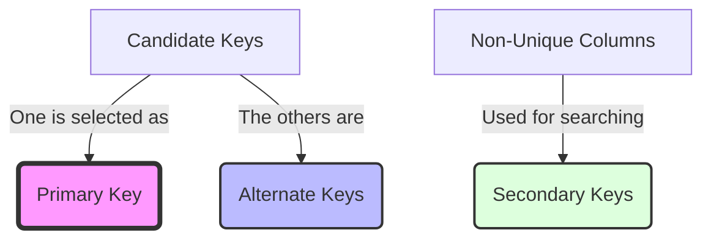

# Data Definition Language (DDL)

## Table of Contents

* [1. High-Level Overview: Defining Schema](#1-high-level-overview-defining-schema)
* [2. Core Schema Operations](#2-core-schema-operations)
    * [2.1 CREATE](#21-create)
    * [2.2 DROP](#22-drop)
    * [2.3 TRUNCATE](#23-truncate)
* [3. Data Integrity: Constraints](#3-data-integrity-constraints)
    * [3.1 CHECK Constraints](#31-check-constraints)
    * [3.2 DEFAULT Values](#32-default-values)
    * [3.3 Auto-Incrementing Columns](#33-auto-incrementing-columns)
* [4. Relational Integrity](#4-relational-integrity)
    * [4.1 Referential Integrity](#41-referential-integrity)
    * [4.2 CASCADE Actions](#42-cascade-actions)
* [5. Key Identification](#5-key-identification)
    * [5.1 Primary vs. Secondary/Alternate Keys](#51-primary-vs-secondaryalternate-keys)
* [6. Summary Checklist](#6-summary-checklist)

***

## 1. High-Level Overview: Defining Schema

In the world of Relational Database Management Systems (RDBMS), data doesn't just exist in a vacuum; it lives within a rigid, predefined structure. **Defining a Schema** is the process of architecting this structure. 

A **Schema** is the blueprint of the database. It defines the tables, the columns within those tables, the data types allowed (integers, strings, dates), and the rules (**constraints**) that govern how data can be entered. If the data is the "furniture," the schema is the "floor plan" and "room dimensions" of the house.

**Data Definition Language (DDL)** is the subset of SQL used specifically to build, modify, and destroy these architectural structures. Unlike DML (Data Manipulation Language), which handles the data itself, DDL handles the containers.

[↑ Back to Table of Contents](#table-of-contents)
***

*Now that we understand the concept of the schema blueprint, let's look at the fundamental commands used to build, remove, or empty those structures.*

## 2. Core Schema Operations

To manage the lifecycle of a database object (like a table), we use three primary DDL commands: `CREATE`, `DROP`, and `TRUNCATE`. While they may seem similar, they operate at very different levels of "destructiveness."

### 2.1 CREATE
The `CREATE` command is used to establish a new object in the database. When creating a table, you must specify the name, the column names, and their corresponding data types.

```sql
CREATE TABLE Users (
    UserID INT PRIMARY KEY,
    Username VARCHAR(50),
    Email VARCHAR(100)
);
```

### 2.2 DROP
The `DROP` command is the most destructive operation. It removes the **entire object** from the database. 

> [!CAUTION]
> When you `DROP` a table, both the structure (the columns/rules) and all the data inside it are permanently deleted. This action cannot be undone without a database backup.

```sql
DROP TABLE Users;
```

### 2.3 TRUNCATE
The `TRUNCATE` command is a middle ground. It removes **all rows** from a table but **keeps the structure** intact. It is like emptying a bookshelf: the shelves (the columns and rules) remain, but all the books (the data) are gone.

```sql
TRUNCATE TABLE Users;
```

**Comparison: CREATE vs. DROP vs. TRUNCATE**

| Feature | `CREATE` | `DROP` | `TRUNCATE` |
| :--- | :--- | :--- | :--- |
| **Primary Action** | Builds a new structure. | Destroys the structure entirely. | Empties the structure. |
| **Data Status** | Starts empty. | Data is deleted. | Data is deleted. |
| **Structure Status** | Structure is created. | Structure is deleted. | Structure is preserved. |
| **Typical Use Case** | Setting up a new table. | Removing an obsolete table. | Resetting a table for fresh data. |

[↑ Back to Table of Contents](#table-of-contents)
***

*While creating and clearing tables is fundamental, a database is only useful if the data remains accurate and reliable. This is where we apply **Constraints** to enforce business rules.*

## 3. Data Integrity: Constraints

**Constraints** are rules applied to columns or tables to limit the type of data that can be inserted. They act as the "quality control" layer, preventing accidental data entry errors.

### 3.1 CHECK Constraints
A `CHECK` constraint ensures that all values in a column satisfy a specific logical condition. 

```sql
CREATE TABLE Products (
    ProductID INT PRIMARY KEY,
    Price DECIMAL(10, 2),
    CHECK (Price > 0) -- Ensures no product can have a zero or negative price
);
```

### 3.2 DEFAULT Values
The `DEFAULT` constraint provides a fallback value for a column if no value is specified during an `INSERT` operation.

```sql
CREATE TABLE Orders (
    OrderID INT PRIMARY KEY,
    OrderDate DATE DEFAULT CURRENT_DATE,
    Status VARCHAR(20) DEFAULT 'Pending'
);
```

### 3.3 Auto-Incrementing Columns
**Auto-incrementing** (e.g., `AUTO_INCREMENT` in MySQL) is a special type of constraint used primarily for Primary Keys. It automatically generates a unique, sequential integer for every new row.

> [!TIP]
> Use auto-incrementing columns for your Primary Keys to avoid the manual overhead of tracking which ID was last used.

```sql
CREATE TABLE Customers (
    CustomerID INT AUTO_INCREMENT PRIMARY KEY,
    CustomerName VARCHAR(100)
);
```

[↑ Back to Table of Contents](#table-of-contents)
***

*Enforcing rules within a single table is important, but real power comes when we enforce rules across multiple related tables. This brings us to **Relational Integrity**.*

## 4. Relational Integrity

In a relational database, tables are linked via relationships. **Relational Integrity** ensures that these links remain valid and that we don't end up with "orphaned" data.

### 4.1 Referential Integrity
**Referential Integrity** is the property that ensures relationships between tables remain consistent. This is primarily enforced using **Foreign Keys**. 

A Foreign Key in one table must always point to a valid Primary Key in another table.

### 4.2 CASCADE Actions
When you modify or delete data in a "parent" table, what should happen to the "child" records? **CASCADE** actions automate this behavior.

| Action | Effect on Child Records |
| :--- | :--- |
| **`ON DELETE CASCADE`** | If a parent row is deleted, all corresponding child rows are automatically deleted. |
| **`ON UPDATE CASCADE`** | If a parent's Primary Key is updated, the Foreign Key in the child table is updated to match. |

**Example of Cascade:**
```sql
CREATE TABLE OrderItems (
    ItemID INT PRIMARY KEY,
    OrderID INT,
    FOREIGN KEY (OrderID) REFERENCES Orders(OrderID) ON DELETE CASCADE
);
```

> [!IMPORTANT]
> `ON DELETE CASCADE` is powerful but dangerous. It can cause a "chain reaction" of deletions across your database if your relationships are not carefully planned.

[↑ Back to Table of Contents](#table-of-contents)
***

*Finally, to truly understand how data is identified and organized, we must distinguish between the different roles a key can play within a schema.*

## 5. Key Identification

Keys are the backbone of relational modeling. While we often focus on the Primary Key, there are several other types of keys that serve specialized purposes.

### 5.1 Primary vs. Secondary/Alternate Keys

| Key Type | Role | Uniqueness | Nullability |
| :--- | :--- | :--- | :--- |
| **Primary Key** | The main, official unique identifier for a row. | Must be unique. | Cannot be `NULL`. |
| **Alternate Key** | A column that *could* have been the Primary Key. | Must be unique. | Can be `NULL`. |
| **Secondary Key** | A column used for indexing and frequent searching. | Does not have to be unique. | Can be `NULL`. |

#### Visualizing the Key Hierarchy



**The Relationship:**
An **Alternate Key** is essentially any column that qualifies as a "Candidate Key" (it is unique and non-null) but was not chosen to be the **Primary Key**.

**Example:**
Imagine a `Users` table:
* `UserID` (Integer, Auto-increment) $\rightarrow$ **Primary Key**
* `SSN` (Social Security Number, Unique) $\rightarrow$ **Alternate Key**
* `Email` (Unique) $\rightarrow$ **Alternate Key**
* `LastName` (Used for searching) $\rightarrow$ **Secondary Key**

[↑ Back to Table of Contents](#table-of-contents)
***
