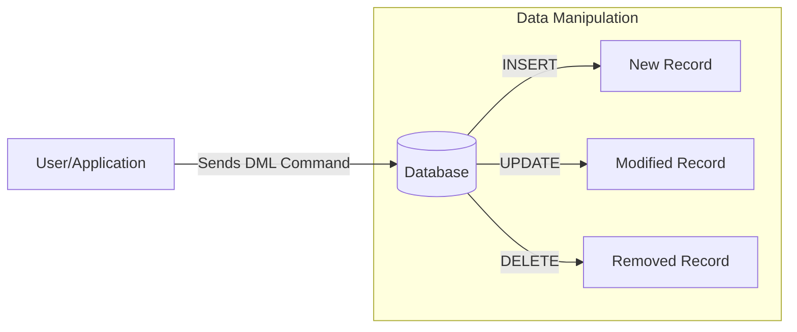

# Data Manipulation Language (DML)

## Table of Contents

* [1. Environment Setup](#1-environment-setup)
* [2. High-Level Overview: What is DML?](#2-high-level-overview-what-is-dml)
* [3. Adding Data: INSERT](#3-adding-data-insert)
* [4. Modifying Data: UPDATE](#4-modifying-data-update)
* [5. Removing Data: DELETE](#5-removing-data-delete)
* [6. Chaos Path: Troubleshooting Common Disasters](#6-chaos-path-troubleshooting-common-disasters)
* [7. DML Summary & Comparison](#7-dml-summary--comparison)

***

## 1. Environment Setup

To follow these examples, ensure you have a `Users` table created. Use the following SQL to initialize your sandbox:

```sql
CREATE TABLE Users (
    UserID INTEGER PRIMARY KEY,
    Username TEXT NOT NULL,
    Email TEXT UNIQUE,
    Age INTEGER,
    Status TEXT DEFAULT 'Active'
);

-- Initial seed data
INSERT INTO Users (Username, Email, Age) 
VALUES ('jdoe', 'jdoe@example.com', 30);
```

[↑ Back to Table of Contents](#table-of-contents)

***

## 2. High-Level Overview: What is DML?

While Data Definition Language (DDL) builds the "house" (the tables and structure), **Data Manipulation Language (DML)** is what we use to actually move the "furniture" in and out. 



DML is the subset of SQL used to manage the data contained within the database objects. It allows you to add new records, change existing information, and remove data that is no longer needed. 

> [!IMPORTANT]
> Unlike DDL, which changes the *structure* of the database, DML changes the *content* of the database.

[↑ Back to Table of Contents](#table-of-contents)

***

## 3. Adding Data: INSERT

The `INSERT` statement is used to add new rows of data into a table.

### Standard Syntax
```sql
INSERT INTO Users (Username, Email, Age)
VALUES ('alice', 'alice@web.com', 25);
```

### Bulk Inserts
Most SQL dialects allow you to insert multiple rows in a single command for better efficiency.

```sql
INSERT INTO Users (Username, Email)
VALUES 
    ('bob', 'bob@web.com'),
    ('charlie', 'charlie@web.com');
```

[↑ Back to Table of Contents](#table-of-contents)

***

## 4. Modifying Data: UPDATE

The `UPDATE` statement allows you to modify existing records in a table.

### Standard Syntax
```sql
UPDATE Users
SET Email = 'john.new@email.com'
WHERE UserID = 1;
```

> [!WARNING]
> **The "Missing WHERE" Catastrophe:** If you execute an `UPDATE` statement without a `WHERE` clause, **every single row** in the table will be updated with the new value.

```sql
-- DANGER: This sets EVERY user's status to 'Inactive'
UPDATE Users SET Status = 'Inactive'; 
```

[↑ Back to Table of Contents](#table-of-contents)

***

## 5. Removing Data: DELETE

The `DELETE` statement is used to remove specific rows from a table.

### Standard Syntax
```sql
DELETE FROM Users
WHERE UserID = 5;
```

> [!WARNING]
> **The "Missing WHERE" Catastrophe:** Running `DELETE FROM Users;` without a `WHERE` clause will wipe **every single row** from the table, leaving you with an empty structure.

### DELETE vs. TRUNCATE

| Feature | `DELETE` | `TRUNCATE` |
| :--- | :--- | :--- |
| **Type** | DML (Data Manipulation) | DDL (Data Definition) |
| **Granularity** | Can delete specific rows via `WHERE`. | Removes **all** rows in the table. |
| **Speed** | Slower (logs each row deletion). | Faster (deallocates data pages). |
| **Transaction** | Can be rolled back. | Often auto-commits. |

[↑ Back to Table of Contents](#table-of-contents)

***

## 6. Chaos Path: Troubleshooting Common Disasters

When working with DML in a production environment, errors can be catastrophic. Use this guide to diagnose and respond to common mistakes.

### Scenario: The Accidental Global Update/Delete
**Symptom:** All users in the system suddenly have the same Email, or the entire User table is empty.

**Diagnosis:** 
An `UPDATE` or `DELETE` statement was executed without a `WHERE` clause, applying the command to every record in the table.

**Rescue:**
1.  **Immediate Action:** If you are working within a transaction block, immediately run `ROLLBACK;`.
2.  **Recovery:** If the command was already committed, you must restore the database from the most recent backup or use Point-in-Time Recovery (PITR) if your database engine supports it.
3.  **Prevention:** Always run a `SELECT` statement with your intended `WHERE` clause *before* running the `UPDATE` or `DELETE` to verify exactly which rows will be affected.

[↑ Back to Table of Contents](#table-of-contents)

***

## 7. DML Summary & Comparison

| Command | Primary Purpose | Typical Clause | Risk Level |
| :--- | :--- | :--- | :--- |
| **`INSERT`** | Add new records. | `VALUES` | Low |
| **`UPDATE`** | Change existing records. | `SET ... WHERE` | **High** (Missing `WHERE`) |
| **`DELETE`** | Remove specific records. | `WHERE` | **High** (Missing `WHERE`) |

[↑ Back to Table of Contents](#table-of-contents)