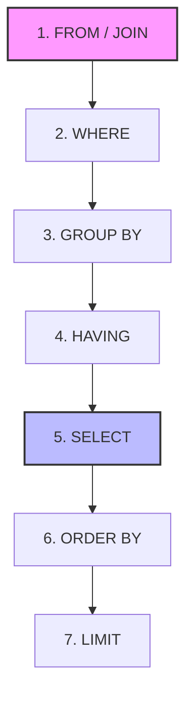

# Data Query Language (DQL)

## Table of Contents

* [1. High-Level Overview](#1-high-level-overview)
* [2. The Anatomy of a DQL Statement](#2-the-anatomy-of-a-dql-statement)
    * [2.1 Queries](#21-queries)
    * [2.2 Clauses](#22-clauses)
    * [2.3 Aliases](#23-aliases)
    * [2.4 The Logical Execution Order (Visualized)](#24-the-logical-execution-order-visualized)
* [3. Data Processing & Transformation](#3-data-processing--transformation)
    * [3.1 Aggregate Functions](#31-aggregate-functions)
    * [3.2 Scalar Functions](#32-scalar-functions)
    * [3.3 Aggregate Functions vs. Scalar Functions](#33-aggregate-functions-vs-scalar-functions)
    * [3.4 Subqueries](#34-subqueries)
* [4. Relational Data Retrieval](#4-relational-data-retrieval)
    * [4.1 Joins](#41-joins)
    * [4.2 Joins vs. Subqueries](#42-joins-vs-subqueries)
* [5. Chaos Path: Troubleshooting Common Errors](#5-troubleshooting-common-errors)

***

## 1. High-Level Overview

**Data Query Language (DQL)** is the subset of SQL used exclusively for retrieving data from a database. Unlike Data Manipulation Language (DML), which changes the data, or Data Definition Language (DDL), which changes the structure, DQL is "read-only." It allows users to transform raw table rows into meaningful, filtered, and summarized information.

> [!IMPORTANT]
> DQL does not modify the state of the database. It only produces a **result set**—a temporary, virtual table representing the data requested by your query.

[↑ Back to Table of Contents](#table-of-contents)

***

*Now that we understand the purpose of DQL, let's break down the fundamental building blocks of a query.*

## 2. The Anatomy of a DQL Statement

A standard SQL query is composed of several logical parts that work together to define *what* data to get and *how* to present it.

### 2.1 Queries

A **Query** is the complete instruction sent to the database engine. At its most basic level, a query begins with the `SELECT` keyword.

| Component | Keyword | Role |
| :--- | :--- | :--- |
| **Projection** | `SELECT` | Defines *which columns* to retrieve. |
| **Source** | `FROM` | Defines *which table(s)* to retrieve from. |

**Example: Basic Projection**
```sql
SELECT first_name, last_name 
FROM employees;
```
*This query retrieves only the name columns from the entire employees table.*

[↑ Back to Table of Contents](#table-of-contents)

***

*While the `SELECT` and `FROM` clauses define the "What" and "Where," we need **Clauses** to refine the "How much" and "In what order."*

### 2.2 Clauses

**Clauses** are specialized keywords that allow you to filter, sort, and limit the result set. They act as modifiers to the base query.

| Clause | Purpose | Example |
| :--- | :--- | :--- |
| `WHERE` | **Filters rows** based on specific conditions before any grouping occurs. | `WHERE salary > 50000` |
| `GROUP BY` | **Groups rows** that have the same values into summary rows. | `GROUP BY department_id` |
| `HAVING` | **Filters groups** based on conditions applied to aggregate values. | `HAVING COUNT(*) > 5` |
| `ORDER BY` | **Sorts the results** in ascending (`ASC`) or descending (`DESC`) order. | `ORDER BY hire_date DESC` |
| `LIMIT` / `TOP` | **Restricts the number** of rows returned. | `LIMIT 10` |

[↑ Back to Table of Contents](#table-of-contents)

***

*Queries can become cumbersome to read and write as they grow in complexity. **Aliases** allow you to reduce that complexity.*

### 2.3 Aliases

**Aliases** are temporary names assigned to columns or tables during the execution of a query. They are created using the `AS` keyword.

**Common Use Cases:**
* **Improving Readability:** Renaming `first_name` to `Name` in the final report.
* **Handling Calculations:** Giving a name to the result of a math operation (e.g., `price * tax AS total_cost`).
* **Simplifying Joins:** Shortening long table names to single letters (e.g., `employees AS e`).

**Example:**
```sql
SELECT first_name AS Name, salary * 1.1 AS Projected_Salary
FROM employees AS e;
```

> [!IMPORTANT]
> **Alias Scope:** In most SQL dialects, you **cannot** use a column alias in a `WHERE` clause because the `WHERE` filter is processed *before* the `SELECT` list (where the alias is defined). However, you can typically use them in `ORDER BY`.

[↑ Back to Table of Contents](#table-of-contents)

***

*The most common source of confusion in SQL is the gap between how we **write** a query and how the database **executes** it. Let's visualize that order.*

### 2.4 The Logical Execution Order (Visualized)

SQL is not executed in the order it is written. If you try to use a name you just created in a `WHERE` clause, the database will fail because it hasn't reached the `SELECT` step yet.



**The Workflow Rule:**
1. **Find the data** (`FROM`)
2. **Filter the rows** (`WHERE`)
3. **Group them** (`GROUP BY`)
4. **Filter the groups** (`HAVING`)
5. **Pick the columns** (`SELECT`)
6. **Sort the results** (`ORDER BY`)

[↑ Back to Table of Contents](#table-of-contents)

***

*Once we can filter and sort individual rows, we can begin performing more complex operations like summarizing data or nesting queries.*

## 3. Data Processing & Transformation

### 3.1 Aggregate Functions

**Aggregate Functions** perform a calculation on a set of values and return a single, summarized value. They are almost always used in conjunction with the `GROUP BY` clause.

| Function | Description | Example |
| :--- | :--- | :--- |
| `COUNT()` | Returns the number of rows. | `COUNT(*)` |
| `SUM()` | Returns the total sum of a numeric column. | `SUM(salary)` |
| `AVG()` | Returns the average value. | `AVG(age)` |
| `MIN()` / `MAX()`| Returns the smallest / largest value. | `MAX(price)` |

[↑ Back to Table of Contents](#table-of-contents)

***

*Sometimes you will need to perform operations across records in a single column without losing the individual data: **scalar functions** are how you do this.*

### 3.2 Scalar Functions

Unlike aggregate functions, **Scalar Functions** operate on a single value and return a single value for every row processed. They are used to transform data at the row level during retrieval.

**Common Scalar Operations:**
* **String Manipulation:** `UPPER()`, `LOWER()`, `CONCAT()`, `SUBSTRING()`
* **Numeric Transformation:** `ROUND()`, `ABS()`, `CEIL()`, `FLOOR()`
* **Date/Time Formatting:** `DATE()`, `YEAR()`, `NOW()`

[↑ Back to Table of Contents](#table-of-contents)

***

### 3.3 Aggregate Functions vs. Scalar Functions

| Feature | **Aggregate Function** | **Scalar Function** |
| :--- | :--- | :--- |
| **Input** | A collection of values (a column). | A single value (one row). |
| **Output** | One single value for the group. | One value for *every* input row. |
| **Example** | `SUM(sales)` | `UPPER(name)` |

[↑ Back to Table of Contents](#table-of-contents)

***

*Sometimes, a single query isn't enough to answer a complex question. In those cases, we can embed one query inside another.*

### 3.4 Subqueries

A **Subquery** (or Inner Query) is a query nested inside another query (the Outer Query). Subqueries allow you to perform multi-step logic in a single statement.

**Common Subquery Patterns:**
1. **In the `WHERE` clause:** Used to filter results based on a value calculated by another query.
   ```sql
   SELECT name 
   FROM products 
   WHERE price > (SELECT AVG(price) FROM products);
   ```
   *(Finds all products that cost more than the average price.)*

2. **In the `FROM` clause:** Used to treat the result of one query as a temporary table (often called a "Derived Table").
   ```sql
   SELECT AVG(dept_total)
   FROM (SELECT SUM(salary) AS dept_total FROM employees GROUP BY dept_id) AS dept_sums;
   ```

> [!WARNING]
> **Performance Note:** Subqueries, especially "Correlated Subqueries" (where the inner query refers to a column in the outer query), can be significantly slower than **Joins**. Always consider if a Join can achieve the same result more efficiently.

[↑ Back to Table of Contents](#table-of-contents)

***

*While subqueries allow for nested logic, the most powerful way to combine data from different sources is through Relational Operations.*

## 4. Relational Data Retrieval

### 4.1 Joins

**Joins** are used to combine rows from two or more tables based on a related column between them (usually a Foreign Key).

**The Four Fundamental Joins**

| Join Type | Visual Representation | Description |
| :--- | :--- | :--- |
| **`INNER JOIN`** | Intersection ($\cap$) | Returns records that have matching values in **both** tables. |
| **`LEFT (OUTER) JOIN`** | Left Circle ($\subset$) | Returns **all** records from the left table, and matched records from the right. Unmatched right-side columns return `NULL`. |
| **`RIGHT (OUTER) JOIN`** | Right Circle ($\supset$) | Returns **all** records from the right table, and matched records from the left. Unmatched left-side columns return `NULL`. |
| **`FULL (OUTER) JOIN`** | Union ($\cup$) | Returns all records when there is a match in **either** left or right table. |

**Example: The Classic Inner Join**
```sql
SELECT employees.name, departments.dept_name
FROM employees
INNER JOIN departments ON employees.dept_id = departments.id;
```

[↑ Back to Table of Contents](#table-of-contents)

***

### 4.2 Joins vs. Subqueries

| Feature | **Join** | **Subquery** |
| :--- | :--- | :--- |
| **Primary Goal** | Combining columns from multiple tables. | Filtering/calculating based on a secondary set. |
| **Result Set** | Can return columns from both tables. | Usually only returns columns from the outer table. |
| **Efficiency** | Generally faster for large datasets. | Can be slower if highly nested/correlated. |

[↑ Back to Table of Contents](#table-of-contents)

***

## 5. Troubleshooting Common Errors

When your query doesn't behave as expected, it is usually due to a misunder's of the **Logical Execution Order** or how **Aggregation** works.

### 5.1 Error: "Unknown Column in 'where clause'" (The Alias Trap)
**Symptom:** You create an alias in the `SELECT` clause, but when you try to use it in the `WHERE` clause, the database returns an error.
**Example:** `SELECT salary * 12 AS annual_salary FROM employees WHERE annual_salary > 50000;` $\rightarrow$ **FAIL**.
**Diagnosis:** Refer to the **Logical Execution Order**. The `WHERE` clause is executed *before* the `SELECT` clause. At the time of filtering, `annual_salary` does not exist yet.
**Rescue:** 
* Use the original calculation in the `WHERE` clause: `WHERE salary * 12 > 50000`.
* Or, use a **Subquery** or **CTE** to "pre-calculate" the alias.

### 5.2 Error: "Column must appear in GROUP BY clause"
**Symptom:** You try to select a standard column alongside an aggregate function (like `SUM`), but the database throws an error.
**Example:** `SELECT department_id, employee_name, SUM(salary) FROM employees GROUP BY department_id;` $\rightarrow$ **FAIL**.
**Diagnosis:** When using `GROUP BY`, every column in your `SELECT` list must either be:
1. One of the columns listed in the `GROUP BY` clause.
2. An argument inside an **Aggregate Function**.
The database doesn't know *which* `employee_name` to show for the whole department.
**Rescue:** Either add `employee_name` to the `GROUP BY` clause (which changes the granularity) or remove it from the `SELECT` list.

[↑ Back to Table of Contents](#table-of-contents)