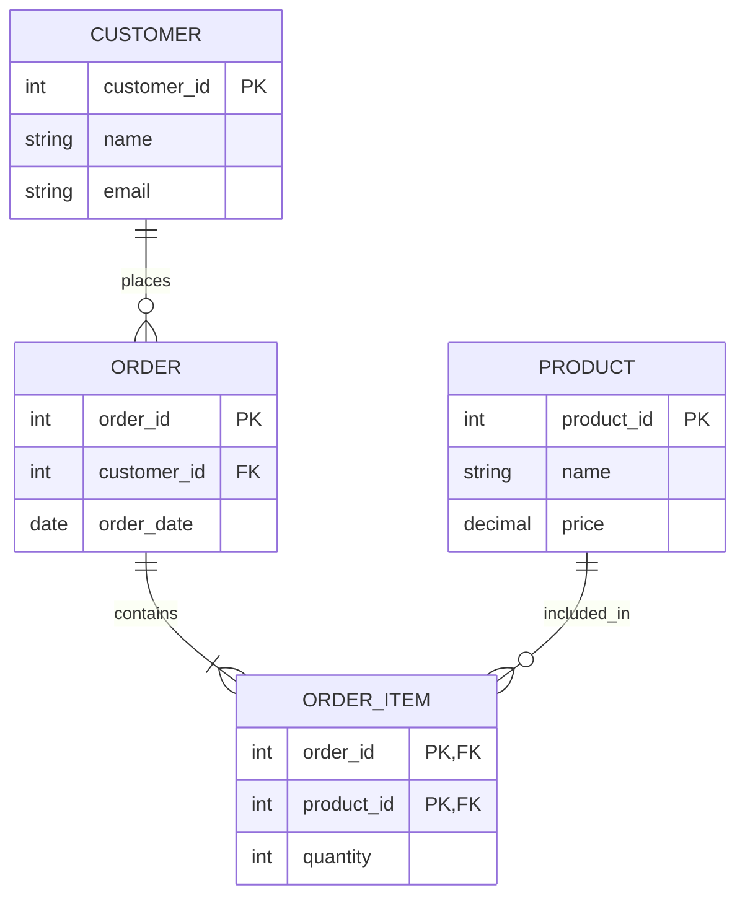

# SQL Structure & Data Modeling

## Table of Contents

* [1. High-Level Overview: Data Modeling & ERD](#1-high-level-overview-data-modeling--erd)
* [2. The Blueprint: Schema & Table Structure](#2-the-blueprint-schema--table-structure)
* [3. The Rules of Organization: Normalization & Multiplicity](#3-the-rules-of-organization-normalization--multiplicity)
* [4. The Building Blocks: SQL Data Types](#4-the-building-blocks-sql-data-types)
* [5. The Connectors: Keys](#5-the-connectors-keys)
    * [5.1 Primary & Composite Keys](#51-primary--composite-keys)
    * [5.2 Unique & Foreign Keys](#52-unique--foreign-keys)
    * [5.3 Advanced: Surrogate vs. Natural Keys](#53-advanced-surrogate-vs-natural-keys)

***

## 1. High-Level Overview: Data Modeling & ERD

Before a single line of SQL is written, a database must be designed. This phase is known as **Data Modeling**. It is the process of defining the data requirements, the relationships between data elements, and the constraints that will govern them.

The primary tool used during this phase is the **Entity-Relationship Diagram (ERD)**. An ERD is a visual representation of the database structure, allowing designers to map out complex systems before implementation.

### Core ERD Components

| Component | Description | SQL Equivalent |
| :--- | :--- | :--- |
| **Entity** | A real-world object or concept (e.g., "Customer", "Product"). | **Table** |
| **Attribute** | A characteristic of an entity (e.g., "Customer Name"). | **Column** |
| **Relationship** | How two entities interact (e.g., "Customer *places* Order"). | **Foreign Key** |

### ERD Visual Example: E-Commerce Relationship

Below is a conceptual ERD representing the relationships between Customers, Orders, and Products.



### Visualizing Relationships (Multiplicity)


In modeling, we must define **Multiplicity** (also called **Cardinality**), which describes how many instances of one entity can relate to instances of another.

* **One-to-One (1:1):** An entity in A is related to exactly one entity in B. (e.g., User $\leftrightarrow$ User Profile).
* **One-to-Many (1:N):** One entity in A can relate to many in B. (e.g., Customer $\rightarrow$ Orders).
* **Many-to-Many (M:N):** Many entities in A can relate to many in B. (e.g., Students $\leftrightarrow$ Courses).

> [!IMPORTANT]
> **The Junction Table Rule:** While **M:N** relationships exist in conceptual models, they cannot be implemented directly in a relational database. You must resolve them by creating a **Junction Table** (also known as an Associative Table) that holds the Foreign Keys of both participating entities.

[↑ Back to Table of Contents](#table-of-contents)
***

*With the visual model complete, we transition from abstract diagrams to the concrete implementation: the technical structure of the database.*

## 2. The Blueprint: Schema & Table Structure

Once the ERD is finalized, we translate it into the database language using a **Schema**.

### The Schema

A **Schema** is the logical container that holds the entire database structure. It defines the organization of tables, views, and constraints. In large-scale environments, schemas are used to provide logical grouping and security boundaries (e.g., a `sales` schema vs. an `inventory` schema).

### Table Structure

A **Table** is the fundamental unit of storage. Its structure is defined by:

* **Columns (Fields):** The vertical components that define the data category (e.g., `email`, `created_at`).
* **Rows (Records):** The horizontal components that represent a single, unique instance of data (e.g., a specific user's profile).

[↑ Back to Table of Contents](#table-of-contents)
***

*A table structure provides the containers, but without rules, data can quickly become messy and redundant. To prevent this, we use Normalization.*

## 3. The Rules of Organization: Normalization & Multiplicity

**Normalization** is the systematic process of organizing data in a database to reduce **Redundancy** and improve **Data Integrity**. The goal is to ensure that every piece of data is stored in exactly one place, preventing "update anomalies" where changing a value in one place leaves old values elsewhere.

### The Goal of Normalization

1. **Eliminate Redundant Data:** Avoid storing the same information (like a customer's address) in multiple tables.
2. **Ensure Data Dependencies:** Ensure that data is stored logically (e.g., a "Product Price" should be in the `Products` table, not the `Orders` table).

### Normal Forms (The Progression)

Normalization is achieved through a series of stages called **Normal Forms (NF)**.

| Normal Form | Core Requirement | Purpose |
| :--- | :--- | :--- |
| **1NF** (First) | **Atomicity** | Removes duplicate columns and ensures every cell contains a single, indivisible value. |
| **2NF** (Second) | **Full Functional Dependency** | Meets 1NF and ensures all non-key columns depend on the *entire* primary key (no partial dependencies). |
| **3NF** (Third) | **No Transitive Dependency** | Meets 2NF and ensures no non-key column depends on another non-key column. |

> [!TIP]
> **The "Gold Standard":** For most standard business applications, achieving **3NF** is the target. While higher forms exist (like BCNF), they often add unnecessary complexity for typical web and enterprise applications.

[↑ Back to Table of Contents](#table-of-contents)
***

*With the organizational logic established, we must now define the actual nature of the data being stored: its Type.*

## 4. The Building Blocks: SQL Data Types

Every column in a table must be assigned a **Data Type**. This tells the database how much storage space to allocate, what operations are allowed (e.g., you can't "multiply" a string), and how to sort the data.

### Common SQL Data Types

| Category | Type | Description | Example |
| :--- | :--- | :--- | :--- |
| **Numeric** | `INT` | Whole numbers. | `42` |
| **Numeric** | `DECIMAL(p,s)` | Precise fixed-point numbers (used for money). | `19.99` |
| **Numeric** | `FLOAT` | Approximate floating-point numbers. | `3.14159` |
| **String** | `VARCHAR(n)` | Variable-length text up to `n` characters. | `'Hello World'` |
| **String** | `TEXT` | Long-form, variable-length text. | (Paragraphs) |
| **Date/Time** | `DATE` | Calendar dates (YYYY-MM-DD). | `'2023-10-27'` |
| **Date/Time** | `TIMESTAMP` | Precise moments in time (includes timezone). | `'2023-10-27 10:00:00'` |
| **Boolean** | `BOOLEAN` | Logical truth values. | `TRUE` / `FALSE` |

[↑ Back to Table of Contents](#table-of-contents)
***

*The data types provide the "what," but the "how" of connecting and uniquely identifying these data points is handled by Keys.*

## 5. The Connectors: Keys

Keys are the mechanisms used to identify rows and establish relationships between tables.

### 5.1 Primary & Composite Keys

### Primary Key (PK)
A **Primary Key** is the unique identifier for a record in a table. It must follow two strict rules:
1. It must be **Unique** (no two rows can have the same PK).
2. It cannot be **NULL** (every row must have an identifier).

### Composite Key
A **Composite Key** is a Primary Key that consists of **two or more columns**. This is used when a single column is not sufficient to guarantee uniqueness, but a combination of columns is.

**Example Implementation:**
```sql
-- Creating a table with a Composite Primary Key
CREATE TABLE order_items (
    order_id INT,
    product_id INT,
    quantity INT,
    PRIMARY KEY (order_id, product_id) -- The combination must be unique
);
```

[↑ Back to Table of Contents](#table-of-contents)

### 5.2 Unique & Foreign Keys

### Unique Key
A **Unique Key** ensures that all values in a column are different. 

**Unique vs. Primary Key**
| Feature | Primary Key | Unique Key |
| :--- | :--- | :--- |
| **Purpose** | The official unique identifier for the row. | An additional constraint to prevent duplicates. |
| **Nullability** | **Never** allows `NULL`. | **Allows** `NULL` (in most SQL dialects). |
| **Count** | Only **one** per table. | You can have **multiple** per table. |

### Foreign Key (FK)
A **Foreign Key** is a column that creates a link between two tables. It points to the Primary Key of another table, enforcing **Referential Integrity**.

**Referential Integrity** ensures that you cannot have a record in a child table that points to a non-existent record in a parent table.

**Example Implementation:**
```sql
-- Creating a table with a Foreign Key
CREATE TABLE orders (
    order_id INT PRIMARY KEY,
    customer_id INT,
    order_date DATE,
    -- Linking orders to the customers table
    CONSTRAINT fk_customer 
        FOREIGN KEY (customer_id) 
        REFERENCES customers(customer_id)
);
```

[↑ Back to Table of Contents](#table-of-contents)

### 5.3 Advanced: Surrogate vs. Natural Keys

When designing a Primary Key, you must decide between a **Natural Key** and a **Surrogate Key**.

| Type | Definition | Pros | Cons |
| :--- | :--- | :--- | :--- |
| **Natural Key** | A key composed of data that already exists in the real world (e.g., SSN, Email). | Represents real-world logic; no extra columns needed. | Can change (e.g., user changes email); can be complex/long. |
| **Surrogate Key** | An artificial, system-generated value (e.g., Auto-incrementing `INT` or `UUID`). | Immutable; small and fast for indexing; decoupled from business logic. | Adds an extra column; has no real-world meaning. |

> [!TIP]
> **Industry Standard:** In modern application development, **Surrogate Keys** (specifically `BIGINT` auto-increments or `UUID`s) are preferred for Primary Keys because they are guaranteed to be immutable. If a user changes their email or SSN, your database relationships won't break.

[↑ Back to Table of Contents](#table-of-contents)
