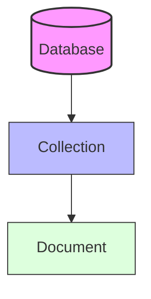

# MongoDB: Concepts

## Table of Contents

* [1. High-Level Overview](#1-high-level-overview)
* [2. The Document Data Model](#2-the-document-data-model)
* [3. Collections and Databases](#3-collections-and-databases)
* [4. BSON (Binary JSON)](#4-bson-binary-json)
* [5. Objectid](#5-objectid)

***

## 1. High-Level Overview

**MongoDB** is a leading NoSQL, document-oriented database designed for scalability, high performance, and flexibility. Unlike traditional relational databases (RDBMS) that rely on rigid tables and rows, MongoDB uses a **schema-flexible** approach, allowing data to be stored in a format that closely resembles the objects used in modern application code.

This module explores the fundamental building blocks of MongoDB: the data model, the organizational structure, the binary format that powers it, and the unique identifiers that ensure data integrity.

[↑ Back to Table of Contents](#table-of-contents)
***

*To understand how MongoDB stores data, we must first look at its primary unit of storage: the document.*

## 2. The Document Data Model

In MongoDB, a **Document** is the basic unit of data. It is a self-describing, schema-flexible structure that maps directly to objects in programming languages like JavaScript, Python, or Java.

### 2.1 Document Structure
Documents are composed of **field-value pairs**. A field is a key (a string), and the value can be a variety of types, including strings, integers, booleans, arrays, or even **nested documents**.

**Example Document:**
```json
{
  "name": "Alice Smith",
  "age": 30,
  "interests": ["cycling", "photography"],
  "address": {
    "city": "New York",
    "zip": "10001"
  }
}
```

### 2.2 Relational vs. Document Models
The primary shift from RDBMS to MongoDB is moving from "Normalizing" data (splitting it into many tables) to "Embedding" data (keeping related data together).

| Feature | Relational (RDBMS) | Document (MongoDB) |
| :--- | :--- | :--- |
| **Basic Unit** | Row | **Document** |
| **Schema** | Rigid (Pre-defined) | **Flexible** (Dynamic) |
| **Relationships** | Joins (linking tables) | **Embedding** (nesting data) |
| **Scalability** | Vertical (bigger servers) | **Horizontal** (sharding/clusters) |

> [!TIP]
> **Embedding vs. Referencing:** Use **Embedding** when data is frequently read together (e.g., a user's address). Use **Referencing** (similar to a Foreign Key) when data is large or shared across many entities to avoid duplication.

[↑ Back to Table of Contents](#table-of-contents)
***

*Documents do not exist in isolation; they are organized into logical groups called collections within databases.*

## 3. Collections and Databases

MongoDB follows a hierarchical structure to organize data: **Database $\rightarrow$ Collection $\rightarrow$ Document**.

### 3.1 Databases
A **Database** is a physical container for collections. A single MongoDB server can host multiple independent databases, each with its own set of permissions and files.

### 3.2 Collections
A **Collection** is a grouping of MongoDB documents. It is the equivalent of a **Table** in a relational database.



**Key Characteristics of Collections:**
* **Schema-less:** Unlike a table, a collection does not enforce a specific structure. Document A in `users` can have 5 fields, while Document B in the same collection has 10.
* **No Joins at the Collection Level:** While you can link data, collections are designed to be independent units of data.

**Collections vs. Tables**
| Concept | RDBMS | MongoDB |
| :--- | :--- | :--- |
| **Container** | Database | **Database** |
| **Grouping** | Table | **Collection** |
| **Structure** | Schema enforced | **Schema-flexible** |

[↑ Back to Table of Contents](#table-of-contents)
***

*While documents look like JSON to a human, MongoDB uses a specialized binary format under the hood to ensure efficiency.*

## 4. BSON (Binary JSON)

While users interact with MongoDB using JSON-like syntax, the database actually stores and transmits data in a format called **BSON**.

### 4.1 What is BSON?
**BSON** stands for **Binary JSON**. It is a binary-encoded serialization of JSON-like documents.

### 4.2 Why BSON instead of JSON?
If JSON is easy for humans to read, why does MongoDB use BSON? The answer lies in **performance** and **data types**.

| Feature | JSON | BSON |
| :--- | :--- | :--- |
| **Format** | Text-based (String) | **Binary-based** |
| **Parsing Speed** | Slower (must parse text) | **Faster** (skips through binary) |
| **Data Types** | Limited (String, Number, Boolean, Null, Array, Object) | **Extensive** (Date, Decimal128, Binary, ObjectId, etc.) |
| **Size** | Smaller for simple text | Slightly larger due to metadata/length headers |

**The "Type" Advantage:**
In JSON, a date is just a string (e.g., `"2023-01-01"`). In BSON, a **Date** is a first-class citizen with a dedicated type, allowing for efficient date-based queries and mathematical operations.

[↑ Back to Table of Contents](#table-of-contents)
***

*Every document in a collection requires a unique way to be identified. This is where the `_id` field and the `ObjectId` come in.*

## 5. ObjectId

Every document in MongoDB must have a unique `_id` field that acts as its **Primary Key**. If you do not provide one, MongoDB automatically generates an **ObjectId**.

### 5.1 What is an ObjectId?
An **ObjectId** is a special 12-byte BSON type used to ensure uniqueness across distributed systems without needing a central authority.

### 5.2 The Anatomy of an ObjectId
An ObjectId is not just a random string; it is a structured value composed of three distinct parts:

1.  **Timestamp (4 bytes):** Represents the seconds since the Unix epoch. This allows you to extract the creation time from the ID itself.
2.  **Random Value (5 bytes):** A random value generated per process to ensure uniqueness across different machines/processes.
3.  **Counter (3 bytes):** An incrementing counter, starting with a random value, to ensure uniqueness within the same machine/process.

**Visual Breakdown:**
`[ 4-byte Timestamp ] + [ 5-byte Random ] + [ 3-byte Counter ]`

> [!IMPORTANT]
> **Uniqueness & Sorting:** Because the first 4 bytes are a timestamp, `ObjectId`s are **naturally sortable by creation time**. This makes them highly efficient for indexing and retrieving documents in the order they were created.

[↑ Back to Table of Contents](#table-of-contents)
